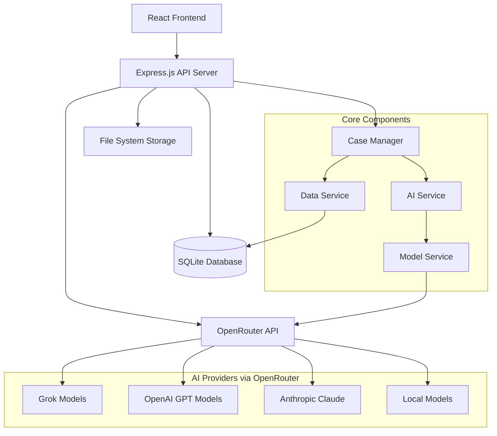

# Design Document

## Overview

The AI-powered case management system is designed as a lightweight, single-page application that integrates generative AI functionality into a three-stage case processing workflow. The system prioritizes simplicity and quick deployment while providing comprehensive AI assistance at every process step.

**Core Design Principles:**
- Minimal infrastructure requirements
- AI-first approach to case processing
- Simple, intuitive user experience
- Extensible architecture for future enhancements
- Cost-effective AI integration

## Architecture

### High-Level Architecture



### Technology Stack

**Frontend:**
- React 19 with TypeScript
- Vite for build tooling
- Tailwind CSS for styling
- TanStack React Query for state management and API caching

**Backend:**
- Node.js with Express.js
- TypeScript for type safety
- SQLite with better-sqlite3 for database
- OpenRouter API for unified LLM access (supporting Grok, GPT-4, Claude, Llama, and other models)
- Axios for HTTP requests to OpenRouter

**Development & Deployment:**
- Node.js runtime with npm package manager
- Local development with hot reload
- Simple deployment to platforms like Railway or Render
- Environment-based configuration

**Environment Configuration:**
```env
# OpenRouter Configuration (Primary AI Provider)
OPENROUTER_API_KEY=your_openrouter_api_key
OPENROUTER_BASE_URL=https://openrouter.ai/api/v1
OPENROUTER_APP_NAME=ai-case-management
OPENROUTER_SITE_URL=https://your-domain.com

# Model Configuration (Requirement 5.1, 5.2, 5.6)
DEFAULT_MODEL=x-ai/grok-beta
FALLBACK_MODEL=openai/gpt-4o-mini
EMERGENCY_FALLBACK_MODEL=openai/gpt-3.5-turbo
ENABLE_MODEL_FALLBACK=true
FALLBACK_ON_ERROR=true
FALLBACK_ON_RATE_LIMIT=true

# AI Parameters (Requirement 5.5)
MAX_TOKENS=4000
TEMPERATURE=0.7
TOP_P=1.0
FREQUENCY_PENALTY=0.0
PRESENCE_PENALTY=0.0
REQUEST_TIMEOUT_MS=30000
MAX_RETRY_ATTEMPTS=3

# Cost Management (Requirement 5.9)
DAILY_COST_LIMIT=5.00
MONTHLY_COST_LIMIT=10.00
COST_ALERT_THRESHOLD=0.8
ENABLE_COST_TRACKING=true
COST_OPTIMIZATION_MODE=balanced # options: speed, cost, quality, balanced

# Model Routing Configuration (Requirement 5.6)
SIMPLE_TASKS_MODEL=openai/gpt-3.5-turbo # For basic summaries
COMPLEX_ANALYSIS_MODEL=x-ai/grok-beta # For detailed analysis
FINAL_SUMMARY_MODEL=openai/gpt-4o # For critical final summaries

# Evaluation Configuration (Requirement 6.1, 6.2, 6.8)
ENABLE_EVALUATION_MODE=false
EVALUATION_MODEL=openai/gpt-4o # Model used for evaluating other models' responses
AUTO_EVALUATION_THRESHOLD=0.7 # Automatic evaluation trigger threshold
COLLECT_USER_FEEDBACK=true
```

### System Flow

1. **Application Submission** → Case creation with AI analysis and missing field detection
2. **Case Management** → Continuous AI assistance, recommendations, and automatic summary updates when notes are added
3. **Case Conclusion** → AI-powered decision support, completeness validation, and final documentation generation

**Key Design Decision**: The system automatically regenerates AI summaries when case notes are added (Requirement 2.4), ensuring that AI insights remain current and incorporate all available information throughout the case lifecycle.

### AI Summary Update Workflow

When case notes are added, the system follows this workflow to maintain current AI insights:

1. **Note Addition** → User adds a case note through the CaseService.addCaseNote() method
2. **Automatic Trigger** → The system automatically triggers AIService.generateOverallSummary() with updated case data
3. **Summary Regeneration** → AI generates a new overall summary incorporating the new note information
4. **Version Management** → The new summary is stored with an incremented version number
5. **UI Update** → Frontend components automatically refresh to display the updated AI insights

This ensures that AI summaries always reflect the most current case information and provide relevant recommendations based on all available data.

## Components and Interfaces

### Frontend Components

#### CaseView Component
- **Purpose**: Main interface for case management
- **Props**: `caseId: string`, `onStatusChange: (status: CaseStatus) => void`
- **State**: Current case data, AI summaries, loading states
- **Features**:
  - Real-time AI summary display
  - Step-specific recommendation panel
  - Case status progression controls
  - Note-taking with AI integration

#### AIInsightPanel Component
- **Purpose**: Display AI-generated summaries and recommendations
- **Props**: `caseId: string`, `step: ProcessStep`, `summaryType: 'overall' | 'step-specific'`
- **Features**:
  - Formatted AI content display
  - Refresh/regenerate AI insights
  - Historical AI summary versions

#### ProcessStepIndicator Component
- **Purpose**: Visual representation of case progress
- **Props**: `currentStep: ProcessStep`, `completedSteps: ProcessStep[]`
- **Features**:
  - Step navigation
  - Progress visualization
  - Step-specific action buttons

#### ModelManagementPanel Component
- **Purpose**: Interface for model configuration and monitoring (Requirement 5.2)
- **Props**: `currentModel: ModelConfig`, `availableModels: ModelInfo[]`
- **Features**:
  - Runtime model switching interface
  - Model health status display
  - Cost monitoring and usage analytics
  - Model performance comparison

#### EvaluationDashboard Component
- **Purpose**: Interface for AI evaluation and optimization (Requirements 6.1-6.10)
- **Props**: `evaluationRuns: EvaluationRun[]`, `datasets: EvaluationDataset[]`
- **Features**:
  - Evaluation dataset management
  - Model comparison visualization
  - A/B test configuration and monitoring
  - Performance metrics and trend analysis

#### UserFeedbackWidget Component
- **Purpose**: Collect user feedback on AI responses (Requirement 6.3)
- **Props**: `interactionId: string`, `aiContent: string`
- **Features**:
  - Thumbs up/down rating interface
  - Detailed feedback form
  - Quality scoring (1-5 scale)
  - Category-based feedback collection

### Backend Services

#### CaseService
```typescript
interface CaseService {
  createCase(applicationData: ApplicationData): Promise<Case>
  updateCaseStatus(caseId: string, status: CaseStatus, userId: string): Promise<Case>
  addCaseNote(caseId: string, note: string, userId: string): Promise<Case>
  getCaseById(caseId: string): Promise<Case>
  getCasesByStatus(status: CaseStatus): Promise<Case[]>
}
```

#### AIService
```typescript
interface AIService {
  generateOverallSummary(caseData: Case, modelConfig?: ModelConfig): Promise<AISummary>
  generateStepRecommendation(caseData: Case, step: ProcessStep, modelConfig?: ModelConfig): Promise<AIRecommendation>
  analyzeApplication(applicationData: ApplicationData, modelConfig?: ModelConfig): Promise<ApplicationAnalysis>
  generateFinalSummary(caseData: Case, modelConfig?: ModelConfig): Promise<FinalSummary>
  validateCaseCompleteness(caseData: Case, modelConfig?: ModelConfig): Promise<CompletenessValidation>
  detectMissingFields(applicationData: ApplicationData, modelConfig?: ModelConfig): Promise<MissingFieldsAnalysis>
}
```

#### ModelService
```typescript
interface ModelService {
  getAvailableModels(): Promise<ModelInfo[]>
  getCurrentModel(): ModelConfig
  setModel(modelId: string, config?: Partial<ModelConfig>): Promise<void>
  callModel(prompt: string, config?: ModelConfig): Promise<ModelResponse>
  getModelHealth(modelId: string): Promise<ModelHealthStatus>
  getModelCosts(): Promise<ModelCostInfo[]>
  testModelConnection(modelId: string): Promise<boolean>
}

interface ModelConfig {
  modelId: string
  provider: 'openrouter'
  apiKey: string
  baseUrl: string // OpenRouter API base URL
  temperature?: number
  maxTokens?: number
  topP?: number
  frequencyPenalty?: number
  presencePenalty?: number
  fallbackModel?: string
  retryAttempts?: number
  timeoutMs?: number
}

interface ModelInfo {
  id: string
  name: string
  provider: string
  description: string
  contextLength: number
  costPer1kTokens: {
    input: number
    output: number
  }
  capabilities: string[]
  isAvailable: boolean
  openRouterModelId: string // The actual model ID used in OpenRouter API calls
}

interface ModelResponse {
  content: string
  model: string
  tokensUsed: {
    input: number
    output: number
  }
  cost?: number
  responseTime: number
  finishReason: string
  openRouterResponse?: any // Raw OpenRouter response for debugging
}

interface ModelHealthStatus {
  isHealthy: boolean
  latency: number
  errorRate: number
  lastChecked: Date
  lastError?: string
}
```

**Design Rationale**: The AIService.validateCaseCompleteness() method supports Requirement 3.3 by providing AI-powered validation that all required steps have been completed before case conclusion, ensuring proper case closure procedures.

#### DataService
```typescript
interface DataService {
  saveCase(case: Case): Promise<void>
  saveSummary(summary: AISummary): Promise<void>
  getAuditTrail(caseId: string): Promise<AuditEntry[]>
  logActivity(activity: ActivityLog): Promise<void>
  logAIInteraction(interaction: AIInteraction): Promise<void>
  getAIInteractionHistory(caseId: string): Promise<AIInteraction[]>
}
```

#### EvaluationService
```typescript
interface EvaluationService {
  createEvaluationDataset(name: string, description: string): Promise<EvaluationDataset>
  addEvaluationExample(datasetId: string, example: EvaluationExample): Promise<void>
  runEvaluation(config: EvaluationConfig): Promise<EvaluationRun>
  getEvaluationResults(runId: string): Promise<EvaluationResults>
  compareModels(modelIds: string[], datasetId: string): Promise<ModelComparison>
  recordUserFeedback(interactionId: string, feedback: UserFeedback): Promise<void>
  getPromptPerformance(promptId: string): Promise<PromptPerformanceMetrics>
  runABTest(testConfig: ABTestConfig): Promise<ABTestResults>
  generateBenchmarkReport(criteria: BenchmarkCriteria): Promise<BenchmarkReport>
  getOptimalConfiguration(operation: string, criteria: OptimizationCriteria): Promise<OptimalConfig>
}
```

**Design Rationale**: The EvaluationService supports Requirements 6.1-6.10 by providing comprehensive tools for AI model and prompt evaluation. Key design decisions include:
- Separate evaluation datasets for different AI operations to ensure targeted benchmarking
- User feedback collection integrated into the main workflow for continuous improvement
- A/B testing capabilities for prompt optimization without disrupting production workflows
- Automated evaluation using separate LLM models to provide objective quality assessments

### API Endpoints

```
POST   /api/cases                    # Create new case
GET    /api/cases/:id                # Get case details
PUT    /api/cases/:id/status         # Update case status
POST   /api/cases/:id/notes          # Add case note
GET    /api/cases/:id/ai-summary     # Get AI summary
POST   /api/cases/:id/ai-refresh     # Regenerate AI insights
GET    /api/cases/:id/audit          # Get audit trail

GET    /api/models                   # Get available models from OpenRouter
GET    /api/models/current           # Get current model configuration
PUT    /api/models/current           # Set current model
GET    /api/models/health            # Get model health status
GET    /api/models/costs             # Get model cost information and usage stats
POST   /api/models/test              # Test connection to a specific model
GET    /api/models/usage             # Get detailed usage analytics per model

POST   /api/evaluation/datasets      # Create evaluation dataset
POST   /api/evaluation/datasets/:id/examples # Add evaluation example
POST   /api/evaluation/run           # Run model evaluation
GET    /api/evaluation/runs/:id      # Get evaluation results
POST   /api/evaluation/compare       # Compare multiple models
POST   /api/evaluation/feedback      # Record user feedback
GET    /api/evaluation/prompts/:id/performance # Get prompt performance metrics
POST   /api/evaluation/ab-test       # Start A/B test
GET    /api/evaluation/ab-test/:id   # Get A/B test results
GET    /api/evaluation/benchmark     # Generate benchmark report
```

## Data Models

### Core Entities

#### Case
```typescript
interface Case {
  id: string
  applicationData: ApplicationData
  status: CaseStatus
  currentStep: ProcessStep
  createdAt: Date
  updatedAt: Date
  assignedTo?: string
  notes: CaseNote[]
  aiSummaries: AISummary[]
  auditTrail: AuditEntry[]
}
```

#### ApplicationData
```typescript
interface ApplicationData {
  applicantName: string
  applicantEmail: string
  applicationType: string
  submissionDate: Date
  documents: Document[]
  formData: Record<string, any>
}
```

#### AISummary
```typescript
interface AISummary {
  id: string
  caseId: string
  type: 'overall' | 'step-specific'
  step?: ProcessStep
  content: string
  recommendations: string[]
  confidence: number
  generatedAt: Date
  version: number
}
```

#### ProcessStep
```typescript
enum ProcessStep {
  RECEIVED = 'received',
  IN_REVIEW = 'in_review',
  ADDITIONAL_INFO_REQUIRED = 'additional_info_required',
  READY_FOR_DECISION = 'ready_for_decision',
  CONCLUDED = 'concluded'
}
```

#### CaseStatus
```typescript
enum CaseStatus {
  ACTIVE = 'active',
  PENDING = 'pending',
  APPROVED = 'approved',
  DENIED = 'denied',
  WITHDRAWN = 'withdrawn',
  ARCHIVED = 'archived'
}
```

#### AIInteraction
```typescript
interface AIInteraction {
  id: string
  caseId: string
  operation: 'generate_summary' | 'generate_recommendation' | 'analyze_application' | 'generate_final_summary' | 'validate_completeness' | 'detect_missing_fields'
  prompt: string
  response: string
  model: string
  tokensUsed: number
  cost?: number
  duration: number
  success: boolean
  error?: string
  timestamp: Date
  stepContext?: ProcessStep
  promptTemplate?: string
  promptVersion?: string
}
```

**Design Rationale**: The AIInteraction model includes promptTemplate and promptVersion fields to support Requirement 4.2, enabling future prompt improvements and evaluations by tracking which specific prompts generated which AI responses.

#### CompletenessValidation
```typescript
interface CompletenessValidation {
  isComplete: boolean
  missingSteps: ProcessStep[]
  missingDocuments: string[]
  recommendations: string[]
  confidence: number
  validatedAt: Date
}
```

#### MissingFieldsAnalysis
```typescript
interface MissingFieldsAnalysis {
  missingFields: {
    fieldName: string
    fieldType: string
    importance: 'required' | 'recommended' | 'optional'
    suggestedAction: string
  }[]
  completenessScore: number
  priorityActions: string[]
  estimatedCompletionTime: string
  analysisTimestamp: Date
}
```

#### ApplicationAnalysis
```typescript
interface ApplicationAnalysis {
  summary: string
  keyPoints: string[]
  potentialIssues: string[]
  recommendedActions: string[]
  priorityLevel: 'low' | 'medium' | 'high' | 'urgent'
  estimatedProcessingTime: string
  requiredDocuments: string[]
  analysisTimestamp: Date
}
```

#### AIRecommendation
```typescript
interface AIRecommendation {
  step: ProcessStep
  recommendations: string[]
  nextSteps: string[]
  requiredDocumentation: string[]
  potentialIssues: string[]
  confidence: number
  generatedAt: Date
}
```

#### FinalSummary
```typescript
interface FinalSummary {
  overallSummary: string
  keyDecisions: string[]
  outcomes: string[]
  processHistory: string[]
  recommendedDecision: 'approved' | 'denied' | 'requires_additional_info'
  supportingRationale: string[]
  generatedAt: Date
}
```

### Evaluation and Benchmarking Models

#### EvaluationDataset
```typescript
interface EvaluationDataset {
  id: string
  name: string
  description: string
  operation: 'generate_summary' | 'generate_recommendation' | 'analyze_application' | 'generate_final_summary' | 'validate_completeness' | 'detect_missing_fields'
  examples: EvaluationExample[]
  createdAt: Date
  updatedAt: Date
  version: number
}
```

#### EvaluationExample
```typescript
interface EvaluationExample {
  id: string
  input: {
    caseData?: Case
    applicationData?: ApplicationData
    step?: ProcessStep
    context?: Record<string, any>
  }
  expectedOutput: {
    content: string
    quality: number // 1-5 scale
    criteria: {
      accuracy: number
      completeness: number
      relevance: number
      clarity: number
    }
  }
  tags: string[]
  difficulty: 'easy' | 'medium' | 'hard'
  createdAt: Date
}
```

#### EvaluationConfig
```typescript
interface EvaluationConfig {
  datasetId: string
  models: string[]
  promptTemplates: string[]
  parameters: {
    temperature: number[]
    maxTokens: number[]
    topP?: number[]
  }
  metrics: ('quality' | 'speed' | 'cost' | 'user_satisfaction')[]
  sampleSize?: number
}
```

#### EvaluationRun
```typescript
interface EvaluationRun {
  id: string
  config: EvaluationConfig
  status: 'running' | 'completed' | 'failed'
  startedAt: Date
  completedAt?: Date
  results: EvaluationResult[]
  summary: {
    totalExamples: number
    completedExamples: number
    averageQuality: number
    averageSpeed: number
    totalCost: number
  }
}
```

#### EvaluationResult
```typescript
interface EvaluationResult {
  id: string
  runId: string
  exampleId: string
  model: string
  promptTemplate: string
  parameters: Record<string, any>
  response: string
  metrics: {
    quality: number
    speed: number
    cost: number
    tokenUsage: number
  }
  scores: {
    accuracy: number
    completeness: number
    relevance: number
    clarity: number
  }
  timestamp: Date
}
```

#### UserFeedback
```typescript
interface UserFeedback {
  id: string
  interactionId: string
  userId: string
  rating: 'thumbs_up' | 'thumbs_down'
  qualityScore: number // 1-5 scale
  feedback: string
  categories: ('accuracy' | 'completeness' | 'relevance' | 'clarity' | 'usefulness')[]
  timestamp: Date
}
```

#### PromptPerformanceMetrics
```typescript
interface PromptPerformanceMetrics {
  promptId: string
  promptTemplate: string
  version: string
  totalUsage: number
  averageQuality: number
  averageSpeed: number
  averageCost: number
  userSatisfactionRate: number
  successRate: number
  commonFailures: string[]
  performanceTrend: {
    date: Date
    quality: number
    usage: number
  }[]
}
```

#### ABTestConfig
```typescript
interface ABTestConfig {
  name: string
  description: string
  operation: string
  variants: {
    id: string
    name: string
    promptTemplate: string
    model: string
    parameters: Record<string, any>
  }[]
  trafficSplit: Record<string, number> // variant ID -> percentage
  successMetrics: string[]
  duration: number // days
  sampleSize: number
}
```

#### ABTestResults
```typescript
interface ABTestResults {
  testId: string
  config: ABTestConfig
  status: 'running' | 'completed' | 'stopped'
  startDate: Date
  endDate?: Date
  variants: {
    variantId: string
    sampleSize: number
    metrics: {
      quality: number
      speed: number
      cost: number
      userSatisfaction: number
      conversionRate: number
    }
    confidenceInterval: {
      lower: number
      upper: number
    }
    statisticalSignificance: boolean
  }[]
  winner?: string
  recommendations: string[]
}
```

#### ModelComparison
```typescript
interface ModelComparison {
  models: string[]
  dataset: string
  metrics: {
    modelId: string
    averageQuality: number
    averageSpeed: number
    averageCost: number
    successRate: number
    userSatisfactionRate: number
    strengths: string[]
    weaknesses: string[]
  }[]
  recommendations: {
    bestOverall: string
    bestForSpeed: string
    bestForCost: string
    bestForQuality: string
  }
  generatedAt: Date
}
```

#### BenchmarkReport
```typescript
interface BenchmarkReport {
  id: string
  title: string
  period: {
    start: Date
    end: Date
  }
  models: string[]
  operations: string[]
  summary: {
    totalInteractions: number
    averageQuality: number
    totalCost: number
    userSatisfactionRate: number
  }
  modelPerformance: {
    modelId: string
    quality: number
    speed: number
    cost: number
    reliability: number
    userSatisfaction: number
  }[]
  promptPerformance: {
    promptId: string
    operation: string
    quality: number
    usage: number
    trend: 'improving' | 'stable' | 'declining'
  }[]
  recommendations: string[]
  generatedAt: Date
}
```

### Database Schema

**Design Rationale**: The database schema is designed to support efficient querying for reporting and analytics (Requirement 4.6). Key design decisions include:
- Indexed fields for common query patterns (status, date ranges, case type)
- Normalized structure to enable aggregation of case metrics and processing times
- Comprehensive audit trail for compliance and performance analysis
- AI interaction logging for usage pattern analysis and cost tracking

#### Cases Table
```sql
CREATE TABLE cases (
  id TEXT PRIMARY KEY,
  application_data TEXT NOT NULL, -- JSON
  status TEXT NOT NULL,
  current_step TEXT NOT NULL,
  created_at DATETIME DEFAULT CURRENT_TIMESTAMP,
  updated_at DATETIME DEFAULT CURRENT_TIMESTAMP,
  assigned_to TEXT
);
```

#### AI Summaries Table
```sql
CREATE TABLE ai_summaries (
  id TEXT PRIMARY KEY,
  case_id TEXT NOT NULL,
  type TEXT NOT NULL, -- 'overall' or 'step-specific'
  step TEXT,
  content TEXT NOT NULL,
  recommendations TEXT, -- JSON array
  confidence REAL,
  generated_at DATETIME DEFAULT CURRENT_TIMESTAMP,
  version INTEGER DEFAULT 1,
  FOREIGN KEY (case_id) REFERENCES cases(id)
);
```

#### Case Notes Table
```sql
CREATE TABLE case_notes (
  id TEXT PRIMARY KEY,
  case_id TEXT NOT NULL,
  content TEXT NOT NULL,
  created_by TEXT NOT NULL,
  created_at DATETIME DEFAULT CURRENT_TIMESTAMP,
  FOREIGN KEY (case_id) REFERENCES cases(id)
);
```

#### Audit Trail Table
```sql
CREATE TABLE audit_trail (
  id TEXT PRIMARY KEY,
  case_id TEXT NOT NULL,
  action TEXT NOT NULL,
  details TEXT, -- JSON
  user_id TEXT NOT NULL,
  timestamp DATETIME DEFAULT CURRENT_TIMESTAMP,
  FOREIGN KEY (case_id) REFERENCES cases(id)
);
```

#### AI Interactions Table
```sql
CREATE TABLE ai_interactions (
  id TEXT PRIMARY KEY,
  case_id TEXT NOT NULL,
  operation TEXT NOT NULL, -- 'generate_summary', 'generate_recommendation', etc.
  prompt TEXT NOT NULL,
  response TEXT NOT NULL,
  model TEXT NOT NULL,
  tokens_used INTEGER,
  cost REAL,
  duration INTEGER, -- milliseconds
  success BOOLEAN NOT NULL,
  error TEXT,
  timestamp DATETIME DEFAULT CURRENT_TIMESTAMP,
  step_context TEXT, -- ProcessStep context
  prompt_template TEXT, -- Template used for prompt generation
  prompt_version TEXT, -- Version of the prompt template
  FOREIGN KEY (case_id) REFERENCES cases(id)
);
```

#### Evaluation Datasets Table
```sql
CREATE TABLE evaluation_datasets (
  id TEXT PRIMARY KEY,
  name TEXT NOT NULL,
  description TEXT,
  operation TEXT NOT NULL, -- AI operation type
  created_at DATETIME DEFAULT CURRENT_TIMESTAMP,
  updated_at DATETIME DEFAULT CURRENT_TIMESTAMP,
  version INTEGER DEFAULT 1
);
```

#### Evaluation Examples Table
```sql
CREATE TABLE evaluation_examples (
  id TEXT PRIMARY KEY,
  dataset_id TEXT NOT NULL,
  input_data TEXT NOT NULL, -- JSON
  expected_output TEXT NOT NULL, -- JSON
  tags TEXT, -- JSON array
  difficulty TEXT NOT NULL, -- 'easy', 'medium', 'hard'
  created_at DATETIME DEFAULT CURRENT_TIMESTAMP,
  FOREIGN KEY (dataset_id) REFERENCES evaluation_datasets(id)
);
```

#### Evaluation Runs Table
```sql
CREATE TABLE evaluation_runs (
  id TEXT PRIMARY KEY,
  dataset_id TEXT NOT NULL,
  config TEXT NOT NULL, -- JSON
  status TEXT NOT NULL, -- 'running', 'completed', 'failed'
  started_at DATETIME DEFAULT CURRENT_TIMESTAMP,
  completed_at DATETIME,
  summary TEXT, -- JSON
  FOREIGN KEY (dataset_id) REFERENCES evaluation_datasets(id)
);
```

#### Evaluation Results Table
```sql
CREATE TABLE evaluation_results (
  id TEXT PRIMARY KEY,
  run_id TEXT NOT NULL,
  example_id TEXT NOT NULL,
  model TEXT NOT NULL,
  prompt_template TEXT,
  parameters TEXT, -- JSON
  response TEXT NOT NULL,
  metrics TEXT NOT NULL, -- JSON
  scores TEXT NOT NULL, -- JSON
  timestamp DATETIME DEFAULT CURRENT_TIMESTAMP,
  FOREIGN KEY (run_id) REFERENCES evaluation_runs(id),
  FOREIGN KEY (example_id) REFERENCES evaluation_examples(id)
);
```

#### User Feedback Table
```sql
CREATE TABLE user_feedback (
  id TEXT PRIMARY KEY,
  interaction_id TEXT NOT NULL,
  user_id TEXT NOT NULL,
  rating TEXT NOT NULL, -- 'thumbs_up', 'thumbs_down'
  quality_score INTEGER, -- 1-5 scale
  feedback TEXT,
  categories TEXT, -- JSON array
  timestamp DATETIME DEFAULT CURRENT_TIMESTAMP,
  FOREIGN KEY (interaction_id) REFERENCES ai_interactions(id)
);
```

#### AB Tests Table
```sql
CREATE TABLE ab_tests (
  id TEXT PRIMARY KEY,
  name TEXT NOT NULL,
  description TEXT,
  config TEXT NOT NULL, -- JSON
  status TEXT NOT NULL, -- 'running', 'completed', 'stopped'
  start_date DATETIME DEFAULT CURRENT_TIMESTAMP,
  end_date DATETIME,
  results TEXT, -- JSON
  winner TEXT
);
```

## Error Handling

## OpenRouter Integration

### OpenRouter Configuration

The system integrates with OpenRouter (https://openrouter.ai) to provide unified access to multiple LLM providers including:

- **Grok Models**: `x-ai/grok-beta`, `x-ai/grok-vision-beta`
- **OpenAI Models**: `openai/gpt-4o`, `openai/gpt-4o-mini`, `openai/gpt-3.5-turbo`
- **Anthropic Models**: `anthropic/claude-3.5-sonnet`, `anthropic/claude-3-haiku`
- **Meta Models**: `meta-llama/llama-3.1-405b-instruct`, `meta-llama/llama-3.1-70b-instruct`
- **Local Models**: Support for locally hosted models through OpenRouter's API

### OpenRouter API Implementation

```typescript
interface OpenRouterClient {
  makeRequest(payload: OpenRouterRequest): Promise<OpenRouterResponse>
  getModels(): Promise<OpenRouterModel[]>
  getGenerationInfo(generationId: string): Promise<GenerationInfo>
}

interface OpenRouterRequest {
  model: string
  messages: Array<{
    role: 'system' | 'user' | 'assistant'
    content: string
  }>
  max_tokens?: number
  temperature?: number
  top_p?: number
  frequency_penalty?: number
  presence_penalty?: number
  stream?: boolean
  provider?: {
    order: string[]
    allow_fallbacks: boolean
  }
}

interface OpenRouterResponse {
  id: string
  choices: Array<{
    message: {
      role: string
      content: string
    }
    finish_reason: string
    index: number
  }>
  usage: {
    prompt_tokens: number
    completion_tokens: number
    total_tokens: number
  }
  model: string
  created: number
}

interface OpenRouterModel {
  id: string
  name: string
  description: string
  context_length: number
  pricing: {
    prompt: string
    completion: string
  }
  top_provider: {
    max_completion_tokens: number
    is_moderated: boolean
  }
}
```

### Model Fallback Strategy

The system implements intelligent fallback when primary models are unavailable (Requirement 5.4):

1. **Primary Model**: User-configured default model (e.g., `x-ai/grok-beta`)
2. **Fallback Model**: Configured backup model (e.g., `openai/gpt-4o-mini`)
3. **Emergency Fallback**: System default model (e.g., `openai/gpt-3.5-turbo`)

**Design Rationale**: The three-tier fallback system ensures high availability while maintaining cost control. The system automatically logs fallback events for monitoring and optimization.

### Multi-Model Support and Runtime Configuration

The system supports runtime model switching without application restart (Requirement 5.2):

- **Model Management Interface**: Web-based interface for administrators to switch models
- **Configuration Persistence**: Model settings stored in database and environment variables
- **Hot Swapping**: New model configurations take effect immediately for new requests
- **Gradual Migration**: Support for A/B testing new models before full deployment

### Cost Optimization

OpenRouter provides real-time pricing and the system implements (Requirements 5.6, 5.9):
- **Model Routing**: Route simple tasks to cheaper models, complex analysis to premium models
- **Usage Tracking**: Monitor token usage and costs per model with detailed analytics
- **Budget Controls**: Set spending limits and alerts with automatic throttling
- **Batch Processing**: Group similar requests to optimize API calls
- **Cost Reporting**: Detailed cost breakdowns by model, operation, and time period

### AI Service Error Handling
- **API Rate Limits**: Implement exponential backoff and request queuing with OpenRouter rate limit headers
- **Service Unavailability**: Graceful degradation with cached summaries and automatic fallback to alternative models
- **Invalid Responses**: Validation and fallback to previous summaries or alternative models
- **Cost Management**: Request throttling and usage monitoring with OpenRouter's cost tracking
- **Authentication Errors**: Secure API key rotation and validation

### Application Error Handling
- **Database Errors**: Transaction rollback and error logging
- **Validation Errors**: User-friendly error messages
- **Network Errors**: Retry mechanisms and offline indicators
- **Authentication Errors**: Secure error responses

### Error Response Format
```typescript
interface ErrorResponse {
  error: {
    code: string
    message: string
    details?: any
  }
  timestamp: string
  requestId: string
}
```

## AI Model Evaluation and Optimization System

### Evaluation Framework Design

The system includes a comprehensive evaluation framework to support Requirements 6.1-6.10:

**Core Components:**
- **Evaluation Datasets**: Curated test cases for different AI operations
- **Automated Benchmarking**: Systematic comparison of models and prompts
- **User Feedback Integration**: Real-time quality assessment from users
- **A/B Testing Platform**: Safe experimentation with new configurations
- **Performance Analytics**: Detailed metrics and trend analysis

### Evaluation Workflow

1. **Dataset Creation**: Build evaluation datasets with ground truth examples for each AI operation
2. **Baseline Establishment**: Run initial evaluations to establish performance baselines
3. **Continuous Monitoring**: Track AI performance metrics in production
4. **Optimization Cycles**: Use evaluation results to improve prompts and model selection
5. **User Feedback Loop**: Incorporate user ratings to refine evaluation criteria

**Design Rationale**: The evaluation system is designed as a separate service to avoid impacting production performance while providing comprehensive insights for optimization.

### Model Performance Tracking

The system tracks multiple performance dimensions (Requirement 6.4, 6.6):

- **Quality Metrics**: Accuracy, completeness, relevance, clarity scores
- **Efficiency Metrics**: Response time, token usage, cost per operation
- **User Satisfaction**: Thumbs up/down ratings, detailed feedback scores
- **Reliability Metrics**: Success rate, error frequency, fallback usage

### Prompt Optimization Strategy

**Template Versioning**: All prompts are versioned and tracked (Requirement 4.2)
**A/B Testing**: Safe experimentation with prompt variations (Requirement 6.5)
**Performance Analysis**: Identify high and low-performing prompt patterns (Requirement 6.7)
**Automated Recommendations**: System suggests optimal configurations (Requirement 6.8)

## Testing Strategy

### Unit Testing
- **Frontend**: React Testing Library for component testing
- **Backend**: Jest for service and utility function testing
- **AI Integration**: Mock AI responses for consistent testing
- **Evaluation System**: Isolated testing of evaluation algorithms

### Integration Testing
- **API Endpoints**: Supertest for HTTP endpoint testing
- **Database Operations**: In-memory SQLite for isolated testing
- **AI Service Integration**: Test with actual AI API in staging
- **Evaluation Workflows**: End-to-end evaluation pipeline testing

### End-to-End Testing
- **User Workflows**: Playwright for complete case processing flows
- **AI Integration**: Validate AI summary generation and display
- **Error Scenarios**: Test error handling and recovery
- **Evaluation Interface**: Test evaluation dataset management and reporting

### Test Data Management
- **Fixtures**: Standardized test cases and application data
- **AI Mocks**: Consistent AI responses for predictable testing
- **Database Seeding**: Automated test data setup and teardown
- **Evaluation Datasets**: Curated test cases for AI performance validation

## Performance Considerations

### AI API Optimization
- **Caching**: Store and reuse AI summaries when case data unchanged
- **Batching**: Group multiple AI requests when possible
- **Streaming**: Real-time AI response streaming for better UX

### Database Performance
- **Indexing**: Optimize queries for case retrieval and filtering
- **Connection Pooling**: Efficient database connection management
- **Query Optimization**: Minimize N+1 queries and unnecessary data loading

### Frontend Performance
- **Code Splitting**: Lazy load components and routes
- **State Management**: Efficient React Query caching
- **Bundle Optimization**: Tree shaking and compression

## Security Considerations

### Data Protection
- **Sensitive Data**: Encrypt PII in database storage
- **API Keys**: Secure environment variable management
- **Input Validation**: Sanitize all user inputs and file uploads

### Access Control
- **Authentication**: JWT-based user authentication
- **Authorization**: Role-based access to cases and actions
- **Audit Logging**: Complete activity tracking for compliance

### AI Security
- **Prompt Injection**: Sanitize inputs to AI services
- **Data Leakage**: Ensure AI responses don't expose sensitive data
- **API Security**: Secure API key management and rotation