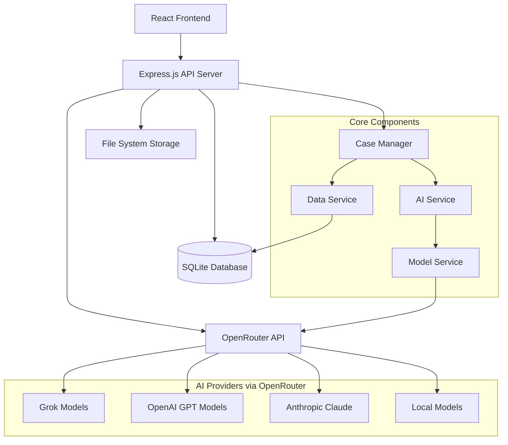

# Design Document

## Overview

The AI-powered case management system is implemented as a full-stack web application with a React frontend and Express.js backend. The system integrates AI functionality through OpenRouter API to provide automated case processing and intelligent recommendations throughout a three-stage workflow.

**Core Design Principles:**
- Minimal infrastructure requirements (SQLite database, no complex deployment)
- AI-first approach to case processing via OpenRouter API
- Simple, intuitive user experience with modern React components
- Extensible architecture for future enhancements
- Cost-effective AI integration with fallback mechanisms

## Architecture

### High-Level Architecture



### Technology Stack

**Frontend:**
- React 19 with TypeScript
- Vite for build tooling and development server
- Tailwind CSS 4.x for styling
- TanStack React Query for state management and API caching
- React Router DOM for client-side routing
- Axios for HTTP requests

**Backend:**
- Node.js with Express.js 5.x
- TypeScript for type safety
- SQLite with better-sqlite3 for database
- OpenRouter API for unified LLM access
- Axios for HTTP requests to OpenRouter
- Zod for schema validation
- Helmet for security headers
- CORS for cross-origin requests

**Development & Testing:**
- Vitest for unit and integration testing
- Playwright for end-to-end testing
- ESLint for code linting
- TypeScript strict mode for type checking
- tsx for development hot reload

**Database:**
- SQLite3 with better-sqlite3 driver
- Schema-based table creation with foreign key constraints
- Indexed queries for performance
- Transaction support for data integrity

**Environment Configuration:**
```env
# OpenRouter Configuration (Primary AI Provider)
OPENROUTER_API_KEY=your_openrouter_api_key
OPENROUTER_BASE_URL=https://openrouter.ai/api/v1
OPENROUTER_APP_NAME=ai-case-management
OPENROUTER_SITE_URL=https://your-domain.com

# Model Configuration
DEFAULT_MODEL=openai/gpt-oss-20b:free
TEMPERATURE=0.7
MAX_TOKENS=4000
REQUEST_TIMEOUT_MS=30000
MAX_RETRY_ATTEMPTS=3

# Database Configuration
DATABASE_PATH=./data/case_management.db

# Server Configuration
PORT=3001
NODE_ENV=development
```

**Note:** The current implementation uses a simplified configuration focused on core functionality. Advanced features like model fallback, cost management, and evaluation systems are designed but not yet implemented.

### System Flow

The system implements a three-stage case processing workflow as specified in the requirements:

#### Stage 1: Receive Applications (Requirements 1.1-1.6)
1. **Application Submission** → New application data is submitted through the frontend interface
2. **Automatic Case Creation** → System creates a new case record with unique identifier and "Received" status
3. **Data Extraction** → Key application data (applicant info, type, submission date) is extracted and stored
4. **AI Analysis** → AI generates comprehensive overall case summary highlighting key points and potential issues
5. **Step-Specific Recommendations** → AI provides specific recommendations for the "Receive Application" step
6. **Missing Field Detection** → AI identifies incomplete information and suggests follow-up actions

#### Stage 2: Case Management (Requirements 2.1-2.6)
1. **Continuous AI Assistance** → Overall AI-generated case summary is continuously updated throughout the process
2. **Step-Specific Insights** → AI provides recommendations for case management actions, next steps, and required documentation
3. **Status Management** → Case status changes are logged with timestamps and trigger relevant AI summary regeneration
4. **Note Integration** → Manual case notes automatically trigger overall AI case summary updates to incorporate new information
5. **Progress Tracking** → AI provides step-specific insights based on current case state and historical data
6. **Documentation Tracking** → System tracks outstanding requirements with AI-suggested follow-up actions

#### Stage 3: Conclude Applications (Requirements 3.1-3.5)
1. **Conclusion Recommendations** → AI provides specific recommendations for case conclusion including suggested decision and rationale
2. **Final Summary Generation** → AI generates comprehensive final case summary with key decisions, outcomes, and process history
3. **Completeness Validation** → AI validates that all required steps have been completed before case conclusion
4. **Decision Support** → System requires final decision status with AI-generated decision support
5. **Final Documentation** → System generates final documentation and archives the case with updated overall AI summary

**Key Design Decision**: The system automatically regenerates AI summaries when case notes are added (Requirement 2.4), ensuring that AI insights remain current and incorporate all available information throughout the case lifecycle.

**Process Step Mapping**: The ProcessStep enum provides granular tracking within the three-stage workflow:
- **Stage 1 (Receive)**: RECEIVED
- **Stage 2 (Manage)**: IN_REVIEW, ADDITIONAL_INFO_REQUIRED, READY_FOR_DECISION  
- **Stage 3 (Conclude)**: CONCLUDED

### AI Summary Update Workflow

When case notes are added, the system follows this workflow to maintain current AI insights:

1. **Note Addition** → User adds a case note through the CaseService.addCaseNote() method
2. **Automatic Trigger** → The system automatically triggers AIService.generateOverallSummary() with updated case data
3. **Summary Regeneration** → AI generates a new overall summary incorporating the new note information
4. **Version Management** → The new summary is stored with an incremented version number
5. **UI Update** → Frontend components automatically refresh to display the updated AI insights

This ensures that AI summaries always reflect the most current case information and provide relevant recommendations based on all available data.

## Components and Interfaces

### Frontend Components

#### CaseView Component
- **Purpose**: Main interface for case management
- **Props**: `className?: string`
- **Implementation**: Uses React Router params to get case ID, integrates multiple child components
- **Features**:
  - Responsive grid layout (1 column mobile, 3 columns desktop)
  - Case header with basic information
  - Process step indicator
  - AI insights panel
  - Notes section with add/view functionality
  - Action buttons for case operations

#### CaseHeader Component
- **Purpose**: Display case basic information and metadata
- **Props**: `caseId: string`
- **Features**:
  - Case ID display
  - Applicant information
  - Case status and current step
  - Creation and update timestamps

#### ProcessStepIndicator Component
- **Purpose**: Visual representation of case progress through workflow stages
- **Props**: `caseId: string`, `caseData?: Case`
- **Features**:
  - Step-by-step progress visualization
  - Current step highlighting
  - Interactive step navigation

#### AIInsightPanel Component
- **Purpose**: Display AI-generated summaries and recommendations
- **Props**: `caseId: string`
- **Features**:
  - AI summary display with loading states
  - Refresh/regenerate AI insights button
  - Error handling for AI service failures
  - Fallback content when AI is unavailable

#### NotesSection Component
- **Purpose**: Case notes management interface
- **Props**: `caseId: string`
- **Features**:
  - Display existing case notes with timestamps
  - Add new notes with real-time updates
  - Note content validation
  - Loading and error states

#### ActionButtons Component
- **Purpose**: Case action controls and workflow operations
- **Props**: `caseId: string`
- **Features**:
  - Status change buttons
  - Case progression controls
  - Workflow action triggers

#### UI Components
- **LoadingSpinner**: Consistent loading indicator
- **ErrorMessage**: Standardized error display
- **Button**: Reusable button component with variants
- **Input/Textarea**: Form input components
- **Card**: Container component for content sections
- **Badge**: Status and label display
- **Alert**: Notification and message display

### Backend Services

#### CaseService
```typescript
class CaseService {
  // Core case management methods
  createCase(applicationData: ApplicationData, userId?: string): Promise<Case>
  createCaseWithoutAI(applicationData: ApplicationData, userId?: string): Promise<Case>
  processApplication(applicationData: ApplicationData, userId?: string): Promise<{
    case: Case;
    applicationAnalysis: ApplicationAnalysis;
    missingFieldsAnalysis: MissingFieldsAnalysis;
  }>
  
  // Case operations
  updateCaseStatus(caseId: string, status: CaseStatus, userId: string): Promise<Case>
  addCaseNote(caseId: string, note: string, userId: string): Promise<Case>
  getCaseById(caseId: string): Promise<Case | null>
  getCasesByStatus(status: CaseStatus): Promise<Case[]>
  getAllCases(params?: {
    status?: string;
    page?: number;
    limit?: number;
  }): Promise<{ cases: Case[]; total: number; page: number; limit: number }>
}
```

#### AIService
```typescript
class AIService {
  // Core AI operations with prompt template integration
  generateOverallSummary(caseData: Case): Promise<AISummary>
  generateStepRecommendation(caseData: Case, step: ProcessStep): Promise<AIRecommendation>
  analyzeApplication(applicationData: ApplicationData): Promise<ApplicationAnalysis>
  generateFinalSummary(caseData: Case): Promise<FinalSummary>
  validateCaseCompleteness(caseData: Case): Promise<CompletenessValidation>
  detectMissingFields(applicationData: ApplicationData): Promise<MissingFieldsAnalysis>
  
  // Features:
  // - Comprehensive error handling with fallback responses in development/test mode
  // - AI interaction logging for all operations
  // - Prompt template service integration for consistent AI prompts
  // - Response validation using Zod schemas
  // - Automatic retry logic through OpenRouter client
}
```

#### OpenRouterClient
```typescript
class OpenRouterClient {
  // Core OpenRouter API integration
  makeRequest(prompt: string, options?: Partial<OpenRouterRequest>): Promise<ModelResponse>
  getModels(): Promise<OpenRouterModel[]>
  testConnection(): Promise<boolean>
  updateConfig(newConfig: Partial<ModelConfig>): void
  getConfig(): ModelConfig
  
  // Features:
  // - Exponential backoff retry logic with configurable attempts
  // - Comprehensive error handling and logging
  // - Test mode support for development/testing
  // - Request timeout and rate limiting
  // - Token usage and cost tracking
}

interface ModelConfig {
  modelId: string
  provider: 'openrouter'
  apiKey: string
  baseUrl: string
  temperature?: number
  maxTokens?: number
  topP?: number
  frequencyPenalty?: number
  presencePenalty?: number
  retryAttempts?: number
  timeoutMs?: number
}

interface ModelResponse {
  content: string
  model: string
  tokensUsed: {
    input: number
    output: number
  }
  responseTime: number
  finishReason: string
  openRouterResponse?: any
}
```

#### PromptTemplateService
```typescript
class PromptTemplateService {
  // Prompt template management for consistent AI interactions
  generatePrompt(templateId: string, data: Record<string, unknown>): string
  getTemplateParameters(templateId: string): Record<string, unknown>
  validateResponse<T>(templateId: string, response: string): ValidationResult<T>
  
  // Supported templates:
  // - overall_summary_v1: Case overview and recommendations
  // - step_recommendation_v1: Step-specific guidance
  // - application_analysis_v1: Initial application assessment
  // - final_summary_v1: Case conclusion summary
  // - completeness_validation_v1: Case readiness validation
  // - missing_fields_v1: Field completeness analysis
}
```

#### DataService
```typescript
class DataService {
  // Case data operations
  saveCase(caseData: Case): Promise<void>
  getCase(caseId: string): Promise<Case | null>
  getAllCases(): Promise<Case[]>
  getCasesByStatus(status: CaseStatus): Promise<Case[]>
  updateCase(caseId: string, updates: Partial<Case>): Promise<void>
  
  // Case notes operations
  addCaseNote(caseId: string, content: string, userId: string): Promise<void>
  getCaseNotes(caseId: string): Promise<CaseNote[]>
  
  // AI summaries operations
  saveSummary(summary: AISummary): Promise<void>
  getAISummaries(caseId: string): Promise<AISummary[]>
  
  // Audit and logging operations
  logActivity(activity: ActivityLog): Promise<void>
  getAuditTrail(caseId: string): Promise<AuditEntry[]>
  logAIInteraction(interaction: AIInteraction): Promise<void>
  getAIInteractionHistory(caseId: string): Promise<AIInteraction[]>
  
  // Features:
  // - SQLite database with better-sqlite3 driver
  // - Transaction support for data integrity
  // - Comprehensive error handling and logging
  // - Foreign key constraints and data validation
}
```

**Note**: Advanced services like EvaluationService, ModelService, and comprehensive model management are designed but not yet implemented in the current version. The system currently focuses on core case management functionality with basic AI integration.

### API Endpoints

**Design Rationale**: The API follows RESTful principles with comprehensive security, performance, and documentation requirements (Requirement 7). All endpoints implement authentication, input validation, rate limiting, and standardized error responses.

#### Implemented API Endpoints

**Core Case Management Endpoints**
```
POST   /api/cases                    # Create new case with application data
GET    /api/cases                    # List all cases with optional filtering and pagination
GET    /api/cases/:id                # Get case details by ID
GET    /api/cases/:id/ai-summary     # Generate and retrieve AI summary for case
POST   /api/cases/:id/ai-refresh     # Refresh/regenerate AI insights for case
GET    /api/cases/:id/notes          # Get all notes for a case
POST   /api/cases/:id/notes          # Add new note to case
```

**AI Processing Endpoints**
```
POST   /api/ai/analyze-application   # Analyze application data with AI
POST   /api/ai/validate-completeness # Validate case completeness for conclusion
POST   /api/ai/detect-missing-fields # Detect missing fields in application data
```

**API Features:**
- Comprehensive input validation using Zod schemas
- Standardized error responses with error codes and request IDs
- Request/response logging for debugging
- CORS support for frontend integration
- Express 5.x with TypeScript for type safety

**Response Format:**
```typescript
// Success Response
{
  success: true,
  data: { /* response data */ },
  message?: string,
  timestamp: string
}

// Error Response
{
  error: {
    code: string,
    message: string,
    details?: any
  },
  timestamp: string,
  requestId: string
}
```

**Note**: Advanced endpoints for model management, evaluation, authentication, and comprehensive API documentation are designed but not yet implemented. The current API focuses on core case management and AI processing functionality.

## Data Models

### Core Entities

#### Case
```typescript
interface Case {
  id: string
  applicationData: ApplicationData
  status: CaseStatus
  currentStep: ProcessStep
  createdAt: Date
  updatedAt: Date
  assignedTo?: string
  notes: CaseNote[]
  aiSummaries: AISummary[]
  auditTrail: AuditEntry[]
}
```

#### ApplicationData
```typescript
interface ApplicationData {
  applicantName: string
  applicantEmail: string
  applicationType: string
  submissionDate: Date
  documents: Document[]
  formData: Record<string, any>
}
```

#### AISummary
```typescript
interface AISummary {
  id: string
  caseId: string
  type: 'overall' | 'step-specific'
  step?: ProcessStep
  content: string
  recommendations: string[]
  confidence: number
  generatedAt: Date
  version: number
}
```

#### ProcessStep
```typescript
enum ProcessStep {
  RECEIVED = 'received',
  IN_REVIEW = 'in_review',
  ADDITIONAL_INFO_REQUIRED = 'additional_info_required',
  READY_FOR_DECISION = 'ready_for_decision',
  CONCLUDED = 'concluded'
}
```

#### CaseStatus
```typescript
enum CaseStatus {
  ACTIVE = 'active',
  PENDING = 'pending',
  APPROVED = 'approved',
  DENIED = 'denied',
  WITHDRAWN = 'withdrawn',
  ARCHIVED = 'archived'
}
```

#### AIInteraction
```typescript
interface AIInteraction {
  id: string
  caseId: string
  operation: 'generate_summary' | 'generate_recommendation' | 'analyze_application' | 'generate_final_summary' | 'validate_completeness' | 'detect_missing_fields'
  prompt: string
  response: string
  model: string
  tokensUsed: number
  cost?: number
  duration: number
  success: boolean
  error?: string
  timestamp: Date
  stepContext?: ProcessStep
  promptTemplate?: string
  promptVersion?: string
}
```

**Design Rationale**: The AIInteraction model includes promptTemplate and promptVersion fields to support Requirement 4.2, enabling future prompt improvements and evaluations by tracking which specific prompts generated which AI responses.

#### CompletenessValidation
```typescript
interface CompletenessValidation {
  isComplete: boolean
  missingSteps: ProcessStep[]
  missingDocuments: string[]
  recommendations: string[]
  confidence: number
  validatedAt: Date
}
```

#### MissingFieldsAnalysis
```typescript
interface MissingFieldsAnalysis {
  missingFields: {
    fieldName: string
    fieldType: string
    importance: 'required' | 'recommended' | 'optional'
    suggestedAction: string
  }[]
  completenessScore: number
  priorityActions: string[]
  estimatedCompletionTime: string
  analysisTimestamp: Date
}
```

#### ApplicationAnalysis
```typescript
interface ApplicationAnalysis {
  summary: string
  keyPoints: string[]
  potentialIssues: string[]
  recommendedActions: string[]
  priorityLevel: 'low' | 'medium' | 'high' | 'urgent'
  estimatedProcessingTime: string
  requiredDocuments: string[]
  analysisTimestamp: Date
}
```

#### AIRecommendation
```typescript
interface AIRecommendation {
  step: ProcessStep
  recommendations: string[]
  nextSteps: string[]
  requiredDocumentation: string[]
  potentialIssues: string[]
  confidence: number
  generatedAt: Date
}
```

#### FinalSummary
```typescript
interface FinalSummary {
  overallSummary: string
  keyDecisions: string[]
  outcomes: string[]
  processHistory: string[]
  recommendedDecision: 'approved' | 'denied' | 'requires_additional_info'
  supportingRationale: string[]
  generatedAt: Date
}
```

### Evaluation and Benchmarking Models

#### EvaluationDataset
```typescript
interface EvaluationDataset {
  id: string
  name: string
  description: string
  operation: 'generate_summary' | 'generate_recommendation' | 'analyze_application' | 'generate_final_summary' | 'validate_completeness' | 'detect_missing_fields'
  examples: EvaluationExample[]
  createdAt: Date
  updatedAt: Date
  version: number
}
```

#### EvaluationExample
```typescript
interface EvaluationExample {
  id: string
  input: {
    caseData?: Case
    applicationData?: ApplicationData
    step?: ProcessStep
    context?: Record<string, any>
  }
  expectedOutput: {
    content: string
    quality: number // 1-5 scale
    criteria: {
      accuracy: number
      completeness: number
      relevance: number
      clarity: number
    }
  }
  tags: string[]
  difficulty: 'easy' | 'medium' | 'hard'
  createdAt: Date
}
```

#### EvaluationConfig
```typescript
interface EvaluationConfig {
  datasetId: string
  models: string[]
  promptTemplates: string[]
  parameters: {
    temperature: number[]
    maxTokens: number[]
    topP?: number[]
  }
  metrics: ('quality' | 'speed' | 'cost' | 'user_satisfaction')[]
  sampleSize?: number
}
```

#### EvaluationRun
```typescript
interface EvaluationRun {
  id: string
  config: EvaluationConfig
  status: 'running' | 'completed' | 'failed'
  startedAt: Date
  completedAt?: Date
  results: EvaluationResult[]
  summary: {
    totalExamples: number
    completedExamples: number
    averageQuality: number
    averageSpeed: number
    totalCost: number
  }
}
```

#### EvaluationResult
```typescript
interface EvaluationResult {
  id: string
  runId: string
  exampleId: string
  model: string
  promptTemplate: string
  parameters: Record<string, any>
  response: string
  metrics: {
    quality: number
    speed: number
    cost: number
    tokenUsage: number
  }
  scores: {
    accuracy: number
    completeness: number
    relevance: number
    clarity: number
  }
  timestamp: Date
}
```

#### UserFeedback
```typescript
interface UserFeedback {
  id: string
  interactionId: string
  userId: string
  rating: 'thumbs_up' | 'thumbs_down'
  qualityScore: number // 1-5 scale
  feedback: string
  categories: ('accuracy' | 'completeness' | 'relevance' | 'clarity' | 'usefulness')[]
  timestamp: Date
}
```

#### PromptPerformanceMetrics
```typescript
interface PromptPerformanceMetrics {
  promptId: string
  promptTemplate: string
  version: string
  totalUsage: number
  averageQuality: number
  averageSpeed: number
  averageCost: number
  userSatisfactionRate: number
  successRate: number
  commonFailures: string[]
  performanceTrend: {
    date: Date
    quality: number
    usage: number
  }[]
}
```

#### ABTestConfig
```typescript
interface ABTestConfig {
  name: string
  description: string
  operation: string
  variants: {
    id: string
    name: string
    promptTemplate: string
    model: string
    parameters: Record<string, any>
  }[]
  trafficSplit: Record<string, number> // variant ID -> percentage
  successMetrics: string[]
  duration: number // days
  sampleSize: number
}
```

#### ABTestResults
```typescript
interface ABTestResults {
  testId: string
  config: ABTestConfig
  status: 'running' | 'completed' | 'stopped'
  startDate: Date
  endDate?: Date
  variants: {
    variantId: string
    sampleSize: number
    metrics: {
      quality: number
      speed: number
      cost: number
      userSatisfaction: number
      conversionRate: number
    }
    confidenceInterval: {
      lower: number
      upper: number
    }
    statisticalSignificance: boolean
  }[]
  winner?: string
  recommendations: string[]
}
```

#### ModelComparison
```typescript
interface ModelComparison {
  models: string[]
  dataset: string
  metrics: {
    modelId: string
    averageQuality: number
    averageSpeed: number
    averageCost: number
    successRate: number
    userSatisfactionRate: number
    strengths: string[]
    weaknesses: string[]
  }[]
  recommendations: {
    bestOverall: string
    bestForSpeed: string
    bestForCost: string
    bestForQuality: string
  }
  generatedAt: Date
}
```

#### BenchmarkReport
```typescript
interface BenchmarkReport {
  id: string
  title: string
  period: {
    start: Date
    end: Date
  }
  models: string[]
  operations: string[]
  summary: {
    totalInteractions: number
    averageQuality: number
    totalCost: number
    userSatisfactionRate: number
  }
  modelPerformance: {
    modelId: string
    quality: number
    speed: number
    cost: number
    reliability: number
    userSatisfaction: number
  }[]
  promptPerformance: {
    promptId: string
    operation: string
    quality: number
    usage: number
    trend: 'improving' | 'stable' | 'declining'
  }[]
  recommendations: string[]
  generatedAt: Date
}
```

### Database Schema

**Implementation**: The database uses SQLite3 with better-sqlite3 driver for simplicity and portability. The schema includes comprehensive indexing and foreign key constraints for data integrity.

**Key Features:**
- Transaction support for atomic operations
- Indexed fields for common query patterns (status, dates, case relationships)
- JSON storage for flexible application data and audit details
- Foreign key constraints with CASCADE delete for data consistency
- CHECK constraints for enum validation

#### Implemented Tables

**Cases Table**
```sql
CREATE TABLE cases (
  id TEXT PRIMARY KEY,
  application_data TEXT NOT NULL, -- JSON serialized ApplicationData
  status TEXT NOT NULL CHECK (status IN ('active', 'pending', 'approved', 'denied', 'withdrawn', 'archived')),
  current_step TEXT NOT NULL CHECK (current_step IN ('received', 'in_review', 'additional_info_required', 'ready_for_decision', 'concluded')),
  created_at DATETIME DEFAULT CURRENT_TIMESTAMP,
  updated_at DATETIME DEFAULT CURRENT_TIMESTAMP,
  assigned_to TEXT
);
```

**AI Summaries Table**
```sql
CREATE TABLE ai_summaries (
  id TEXT PRIMARY KEY,
  case_id TEXT NOT NULL,
  type TEXT NOT NULL CHECK (type IN ('overall', 'step-specific')),
  step TEXT CHECK (step IN ('received', 'in_review', 'additional_info_required', 'ready_for_decision', 'concluded')),
  content TEXT NOT NULL,
  recommendations TEXT, -- JSON array
  confidence REAL,
  generated_at DATETIME DEFAULT CURRENT_TIMESTAMP,
  version INTEGER DEFAULT 1,
  FOREIGN KEY (case_id) REFERENCES cases(id) ON DELETE CASCADE
);
```

**Case Notes Table**
```sql
CREATE TABLE case_notes (
  id TEXT PRIMARY KEY,
  case_id TEXT NOT NULL,
  content TEXT NOT NULL,
  created_by TEXT NOT NULL,
  created_at DATETIME DEFAULT CURRENT_TIMESTAMP,
  FOREIGN KEY (case_id) REFERENCES cases(id) ON DELETE CASCADE
);
```

**Audit Trail Table**
```sql
CREATE TABLE audit_trail (
  id TEXT PRIMARY KEY,
  case_id TEXT NOT NULL,
  action TEXT NOT NULL,
  details TEXT, -- JSON serialized details
  user_id TEXT NOT NULL,
  timestamp DATETIME DEFAULT CURRENT_TIMESTAMP,
  FOREIGN KEY (case_id) REFERENCES cases(id) ON DELETE CASCADE
);
```

**AI Interactions Table**
```sql
CREATE TABLE ai_interactions (
  id TEXT PRIMARY KEY,
  case_id TEXT NOT NULL,
  operation TEXT NOT NULL CHECK (operation IN ('generate_summary', 'generate_recommendation', 'analyze_application', 'generate_final_summary', 'validate_completeness', 'detect_missing_fields')),
  prompt TEXT NOT NULL,
  response TEXT NOT NULL,
  model TEXT NOT NULL,
  tokens_used INTEGER,
  cost REAL,
  duration INTEGER NOT NULL, -- milliseconds
  success BOOLEAN NOT NULL,
  error TEXT,
  timestamp DATETIME DEFAULT CURRENT_TIMESTAMP,
  step_context TEXT,
  prompt_template TEXT,
  prompt_version TEXT,
  FOREIGN KEY (case_id) REFERENCES cases(id) ON DELETE CASCADE
);
```

**Database Indexes**
```sql
-- Performance indexes for common queries
CREATE INDEX idx_cases_status ON cases(status);
CREATE INDEX idx_cases_current_step ON cases(current_step);
CREATE INDEX idx_cases_created_at ON cases(created_at);
CREATE INDEX idx_ai_summaries_case_id ON ai_summaries(case_id);
CREATE INDEX idx_case_notes_case_id ON case_notes(case_id);
CREATE INDEX idx_audit_trail_case_id ON audit_trail(case_id);
CREATE INDEX idx_ai_interactions_case_id ON ai_interactions(case_id);
CREATE INDEX idx_ai_interactions_operation ON ai_interactions(operation);
```

**Note**: Advanced tables for evaluation datasets, A/B testing, user feedback, and comprehensive analytics are designed but not yet implemented. The current schema focuses on core case management functionality.

## Current Implementation Status

### Implemented Features

**Core Case Management:**
- ✅ Case creation with application data processing
- ✅ Case retrieval by ID and status filtering
- ✅ Case notes management (add/view)
- ✅ AI summary generation and refresh
- ✅ Comprehensive audit trail logging
- ✅ SQLite database with full schema implementation

**AI Integration:**
- ✅ OpenRouter API client with retry logic and error handling
- ✅ Prompt template service for consistent AI interactions
- ✅ Application analysis and missing fields detection
- ✅ Case completeness validation
- ✅ Fallback responses for development/testing environments
- ✅ AI interaction logging and tracking

**Frontend Interface:**
- ✅ React 19 with TypeScript and modern component architecture
- ✅ Responsive case management interface
- ✅ Real-time case data loading with React Query
- ✅ Process step visualization
- ✅ AI insights panel with refresh capability
- ✅ Notes section with add/view functionality
- ✅ Tailwind CSS for styling

**API and Validation:**
- ✅ RESTful API with Express.js 5.x
- ✅ Comprehensive input validation using Zod schemas
- ✅ Standardized error responses with request IDs
- ✅ CORS support for frontend integration
- ✅ Request/response logging for debugging

**Testing and Development:**
- ✅ Comprehensive test suites with Vitest
- ✅ API integration tests with Supertest
- ✅ Frontend component testing with React Testing Library
- ✅ End-to-end testing with Playwright
- ✅ TypeScript strict mode with comprehensive type checking

### Planned Features (Designed but Not Implemented)

**Advanced AI Features:**
- 🔄 Model management and runtime switching
- 🔄 Cost tracking and budget controls
- 🔄 Model performance evaluation and A/B testing
- 🔄 User feedback collection and analysis
- 🔄 Advanced prompt optimization

**Security and Authentication:**
- 🔄 JWT-based authentication system
- 🔄 Role-based access control (RBAC)
- 🔄 Rate limiting and security headers
- 🔄 File upload security and virus scanning
- 🔄 Comprehensive security logging

**Advanced Features:**
- 🔄 Real-time notifications and updates
- 🔄 Advanced reporting and analytics
- 🔄 Document management and processing
- 🔄 Workflow automation and triggers
- 🔄 API documentation with OpenAPI/Swagger

**Deployment and Operations:**
- 🔄 Health monitoring and status endpoints
- 🔄 Performance metrics and monitoring
- 🔄 Automated deployment pipelines
- 🔄 Backup and recovery procedures

## Error Handling

### Current Implementation

**AI Service Error Handling:**
- **API Failures**: Comprehensive retry logic with exponential backoff
- **Service Unavailability**: Fallback responses in development/test environments
- **Invalid Responses**: Response validation using Zod schemas with detailed error messages
- **Timeout Handling**: Configurable request timeouts with graceful degradation
- **Cost Management**: Token usage tracking and error logging

**Application Error Handling:**
- **Database Errors**: Transaction rollback with detailed error logging
- **Validation Errors**: User-friendly error messages with field-specific feedback
- **Network Errors**: Retry mechanisms with connection status indicators
- **API Errors**: Standardized error response format with request IDs

**Error Response Format:**
```typescript
interface ErrorResponse {
  error: {
    code: string;           // Machine-readable error code
    message: string;        // Human-readable error message
    details?: any;          // Additional error context (dev mode only)
  };
  timestamp: string;        // ISO timestamp
  requestId: string;        // Unique request identifier for tracking
}
```

**Error Categories:**
- `VALIDATION_ERROR`: Input validation failures
- `CASE_NOT_FOUND`: Resource not found errors
- `AI_ANALYSIS_FAILED`: AI service operation failures
- `DATABASE_ERROR`: Data persistence failures
- `NETWORK_ERROR`: External service communication failures

## OpenRouter Integration

### OpenRouter Configuration

The system integrates with OpenRouter (https://openrouter.ai) to provide unified access to multiple LLM providers. The current implementation uses a default free model with support for configurable model selection.

**Current Configuration:**
- **Default Model**: `openai/gpt-oss-20b:free` (for development/testing)
- **Configurable Models**: Support for any OpenRouter-compatible model
- **API Integration**: Full OpenRouter API v1 compatibility
- **Error Handling**: Comprehensive retry logic and fallback mechanisms

**Supported Model Categories:**
- OpenAI models (GPT-3.5, GPT-4 variants)
- Anthropic models (Claude variants)
- Meta models (Llama variants)
- Other open-source and commercial models available through OpenRouter

### OpenRouter API Implementation

**Current Implementation:**
```typescript
class OpenRouterClient {
  // Core API methods
  makeRequest(prompt: string, options?: Partial<OpenRouterRequest>): Promise<ModelResponse>
  getModels(): Promise<OpenRouterModel[]>
  testConnection(): Promise<boolean>
  updateConfig(newConfig: Partial<ModelConfig>): void
  getConfig(): ModelConfig
}

interface OpenRouterRequest {
  model: string
  messages: Array<{
    role: 'user' | 'assistant' | 'system'
    content: string
  }>
  max_tokens?: number
  temperature?: number
  top_p?: number
  frequency_penalty?: number
  presence_penalty?: number
}

interface ModelResponse {
  content: string
  model: string
  tokensUsed: {
    input: number
    output: number
  }
  responseTime: number
  finishReason: string
  openRouterResponse?: any
}
```

**Key Features:**
- **Retry Logic**: Exponential backoff with configurable retry attempts
- **Error Handling**: Comprehensive error catching and logging
- **Test Mode**: Special handling for development/testing environments
- **Token Tracking**: Detailed usage monitoring for cost analysis
- **Timeout Management**: Configurable request timeouts

### Current AI Integration Features

**Implemented:**
- **Single Model Configuration**: Environment-based model selection
- **Retry Logic**: Automatic retry with exponential backoff for failed requests
- **Error Handling**: Graceful degradation with fallback responses in development mode
- **Usage Tracking**: Token usage logging for all AI interactions
- **Response Validation**: Zod schema validation for AI responses
- **Prompt Templates**: Consistent prompt generation using template service

**Development/Test Mode Features:**
- **Fallback Responses**: Realistic fallback data when AI service is unavailable
- **Mock Integration**: Test-friendly AI responses for consistent testing
- **Error Simulation**: Ability to test error handling scenarios

**Planned Enhancements:**
- Multi-model support with runtime switching
- Cost tracking and budget controls
- Model performance monitoring
- Advanced fallback strategies
- A/B testing for model comparison

**AI Service Error Handling:**
- **API Rate Limits**: Exponential backoff retry logic with configurable attempts
- **Service Unavailability**: Fallback responses in development/test environments
- **Invalid Responses**: Zod schema validation with detailed error reporting
- **Authentication Errors**: Secure error handling without exposing API keys
- **Timeout Management**: Configurable request timeouts with graceful failure

**Application Error Handling:**
- **Database Errors**: Transaction rollback with comprehensive error logging
- **Validation Errors**: Field-specific error messages using Zod validation
- **Network Errors**: Retry mechanisms with connection status feedback
- **Resource Errors**: Proper 404 handling for missing cases/resources

## AI Integration Architecture

### Prompt Template System

**Current Implementation:**
- **Template Service**: Centralized prompt template management
- **Template Versioning**: All prompts are versioned for tracking and optimization
- **Response Validation**: Zod schema validation for consistent AI response format
- **Template Categories**: Specialized templates for different AI operations

**Supported Templates:**
- `overall_summary_v1`: Case overview and recommendations
- `step_recommendation_v1`: Step-specific guidance and next actions
- `application_analysis_v1`: Initial application assessment and analysis
- `final_summary_v1`: Case conclusion summary with decisions
- `completeness_validation_v1`: Case readiness validation for conclusion
- `missing_fields_v1`: Field completeness analysis and recommendations

### AI Interaction Logging

**Comprehensive Tracking:**
- All AI requests and responses are logged with metadata
- Token usage and response time tracking
- Error logging with detailed context
- Prompt template and version tracking for optimization
- Success/failure rates for reliability monitoring

**Data Collected:**
- Request/response content and metadata
- Model used and configuration parameters
- Performance metrics (tokens, time, cost)
- Error details and recovery actions
- Context information (case ID, operation type, step)

## Testing Strategy

### Current Testing Implementation

**Unit Testing (Vitest):**
- **Backend Services**: Comprehensive testing of CaseService, AIService, DataService, and OpenRouterClient
- **Database Operations**: SQLite schema validation and CRUD operations testing
- **AI Integration**: Mock AI responses for consistent testing across all operations
- **Validation Logic**: Zod schema validation and error handling testing
- **Utility Functions**: Helper functions and data transformation testing

**Integration Testing (Supertest):**
- **API Endpoints**: Full HTTP endpoint testing with request/response validation
- **Database Integration**: Real database operations with transaction testing
- **AI Service Integration**: Fallback behavior and error handling validation
- **Cross-Service Communication**: Service interaction and data flow testing

**Frontend Testing (React Testing Library):**
- **Component Testing**: Individual component behavior and rendering
- **Hook Testing**: Custom React hooks with mock API responses
- **User Interaction**: Form submission, button clicks, and navigation
- **Error State Testing**: Loading states, error handling, and fallback UI

**End-to-End Testing (Playwright):**
- **Complete User Workflows**: Case creation, viewing, and note management
- **AI Integration**: AI summary generation and display validation
- **Cross-Browser Testing**: Chrome, Firefox, and Safari compatibility
- **Responsive Design**: Mobile and desktop layout validation

**Test Features:**
- **Isolated Testing**: Each test runs in isolation with clean database state
- **Mock Services**: AI service mocking for consistent and fast testing
- **Error Simulation**: Comprehensive error scenario testing
- **Performance Testing**: Response time and load testing for critical paths
- **Type Safety**: TypeScript strict mode ensures type correctness in tests

**Test Data Management:**
- **Fixtures**: Standardized test data for consistent results
- **Database Seeding**: Automated test data setup and cleanup
- **Mock Responses**: Realistic AI responses for predictable testing
- **Test Isolation**: Each test gets a fresh database state

## Performance Considerations

### Current Performance Features

**Database Performance:**
- **Indexing**: Comprehensive indexes on frequently queried fields (status, dates, relationships)
- **Connection Management**: SQLite with better-sqlite3 for optimal performance
- **Query Optimization**: Efficient queries with proper JOIN operations and filtering
- **Transaction Support**: Atomic operations for data integrity

**AI API Optimization:**
- **Retry Logic**: Exponential backoff to handle temporary failures efficiently
- **Timeout Management**: Configurable timeouts to prevent hanging requests
- **Error Handling**: Fast fallback responses in development/test environments
- **Usage Tracking**: Monitor token usage and response times for optimization

**Frontend Performance:**
- **React Query Caching**: Efficient data caching and background updates
- **Component Optimization**: Proper React component memoization and optimization
- **Bundle Optimization**: Vite build optimization with tree shaking
- **Responsive Design**: Efficient CSS with Tailwind for minimal bundle size

**API Performance:**
- **Input Validation**: Fast Zod schema validation with early error detection
- **Response Optimization**: Minimal data transfer with structured responses
- **Error Handling**: Quick error responses with proper HTTP status codes
- **Request Logging**: Efficient logging without performance impact

**Planned Optimizations:**
- AI response caching for unchanged case data
- Request batching for multiple AI operations
- Real-time updates with WebSocket integration
- Advanced database query optimization
- CDN integration for static assets

## Security Considerations

### Current Security Implementation

**Input Validation and Sanitization:**
- **Zod Schema Validation**: Comprehensive input validation for all API endpoints
- **Parameter Validation**: Path and query parameter validation with proper error handling
- **SQL Injection Prevention**: Parameterized queries with better-sqlite3 prepared statements
- **XSS Protection**: Input sanitization and proper data encoding

**API Security:**
- **CORS Configuration**: Proper cross-origin resource sharing setup
- **Error Response Sanitization**: Secure error messages without system information exposure
- **Request ID Tracking**: Unique request IDs for security monitoring and debugging
- **Input Size Limits**: Request body size limits to prevent DoS attacks

**Data Protection:**
- **Environment Variables**: Secure API key management through environment configuration
- **Database Security**: SQLite file permissions and access controls
- **Audit Trail**: Comprehensive logging of all user actions and system events
- **Data Validation**: Type-safe data handling with TypeScript and runtime validation

**AI Security:**
- **API Key Protection**: Secure OpenRouter API key handling without exposure
- **Prompt Injection Prevention**: Input sanitization before AI processing
- **Response Validation**: AI response validation to prevent malicious content
- **Error Handling**: Secure AI error handling without exposing internal details

**Development Security:**
- **Environment Separation**: Clear separation between development, test, and production environments
- **Secure Defaults**: Security-first default configurations
- **Dependency Security**: Regular security audits with `npm audit`
- **Type Safety**: TypeScript strict mode for compile-time security checks

**Planned Security Enhancements:**
- JWT-based authentication system
- Role-based access control (RBAC)
- Rate limiting and request throttling
- Security headers with Helmet.js
- File upload security and validation
- Comprehensive security monitoring and alerting
- HTTPS enforcement and TLS configuration
- Advanced audit logging and compliance features