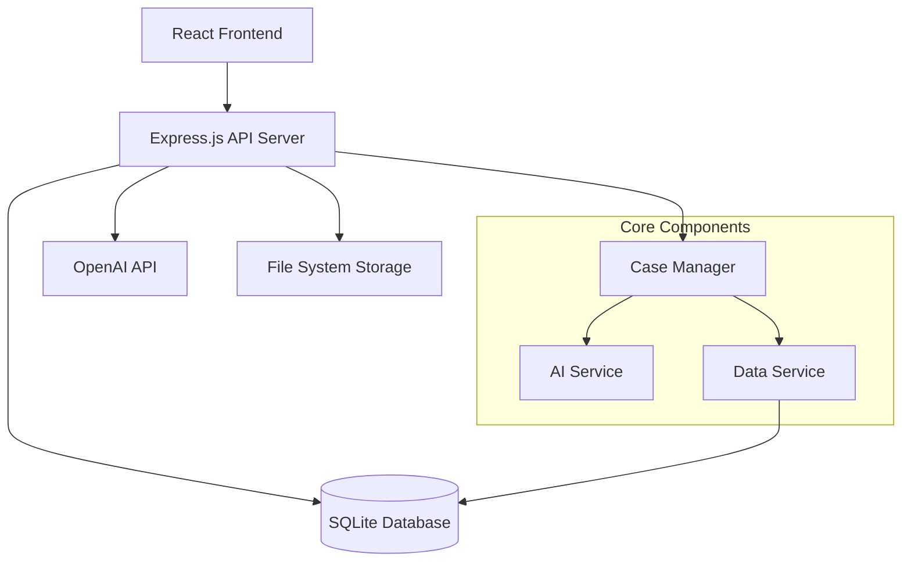

# Design Document

## Overview

The AI-powered case management system is designed as a lightweight, single-page application that integrates generative AI functionality into a three-stage case processing workflow. The system prioritizes simplicity and quick deployment while providing comprehensive AI assistance at every process step.

**Core Design Principles:**
- Minimal infrastructure requirements
- AI-first approach to case processing
- Simple, intuitive user experience
- Extensible architecture for future enhancements
- Cost-effective AI integration

## Architecture

### High-Level Architecture



### Technology Stack

**Frontend:**
- React 19 with TypeScript
- Vite for build tooling
- Tailwind CSS for styling
- React Query for state management and API caching

**Backend:**
- Node.js with Express.js
- TypeScript for type safety
- SQLite with better-sqlite3 for database
- OpenAI API for AI functionality

**Development & Deployment:**
- Node.js runtime with npm package manager
- Local development with hot reload
- Simple deployment to platforms like Railway or Render
- Environment-based configuration

### System Flow

1. **Application Submission** → Case creation with AI analysis
2. **Case Management** → Continuous AI assistance and recommendations
3. **Case Conclusion** → AI-powered decision support and final documentation

## Components and Interfaces

### Frontend Components

#### CaseView Component
- **Purpose**: Main interface for case management
- **Props**: `caseId: string`, `onStatusChange: (status: CaseStatus) => void`
- **State**: Current case data, AI summaries, loading states
- **Features**:
  - Real-time AI summary display
  - Step-specific recommendation panel
  - Case status progression controls
  - Note-taking with AI integration

#### AIInsightPanel Component
- **Purpose**: Display AI-generated summaries and recommendations
- **Props**: `caseId: string`, `step: ProcessStep`, `summaryType: 'overall' | 'step-specific'`
- **Features**:
  - Formatted AI content display
  - Refresh/regenerate AI insights
  - Historical AI summary versions

#### ProcessStepIndicator Component
- **Purpose**: Visual representation of case progress
- **Props**: `currentStep: ProcessStep`, `completedSteps: ProcessStep[]`
- **Features**:
  - Step navigation
  - Progress visualization
  - Step-specific action buttons

### Backend Services

#### CaseService
```typescript
interface CaseService {
  createCase(applicationData: ApplicationData): Promise<Case>
  updateCaseStatus(caseId: string, status: CaseStatus, userId: string): Promise<Case>
  addCaseNote(caseId: string, note: string, userId: string): Promise<Case>
  getCaseById(caseId: string): Promise<Case>
  getCasesByStatus(status: CaseStatus): Promise<Case[]>
}
```

#### AIService
```typescript
interface AIService {
  generateOverallSummary(caseData: Case): Promise<AISummary>
  generateStepRecommendation(caseData: Case, step: ProcessStep): Promise<AIRecommendation>
  analyzeApplication(applicationData: ApplicationData): Promise<ApplicationAnalysis>
  generateFinalSummary(caseData: Case): Promise<FinalSummary>
}
```

#### DataService
```typescript
interface DataService {
  saveCase(case: Case): Promise<void>
  saveSummary(summary: AISummary): Promise<void>
  getAuditTrail(caseId: string): Promise<AuditEntry[]>
  logActivity(activity: ActivityLog): Promise<void>
  logAIInteraction(interaction: AIInteraction): Promise<void>
  getAIInteractionHistory(caseId: string): Promise<AIInteraction[]>
}
```

### API Endpoints

```
POST   /api/cases                    # Create new case
GET    /api/cases/:id                # Get case details
PUT    /api/cases/:id/status         # Update case status
POST   /api/cases/:id/notes          # Add case note
GET    /api/cases/:id/ai-summary     # Get AI summary
POST   /api/cases/:id/ai-refresh     # Regenerate AI insights
GET    /api/cases/:id/audit          # Get audit trail
```

## Data Models

### Core Entities

#### Case
```typescript
interface Case {
  id: string
  applicationData: ApplicationData
  status: CaseStatus
  currentStep: ProcessStep
  createdAt: Date
  updatedAt: Date
  assignedTo?: string
  notes: CaseNote[]
  aiSummaries: AISummary[]
  auditTrail: AuditEntry[]
}
```

#### ApplicationData
```typescript
interface ApplicationData {
  applicantName: string
  applicantEmail: string
  applicationType: string
  submissionDate: Date
  documents: Document[]
  formData: Record<string, any>
}
```

#### AISummary
```typescript
interface AISummary {
  id: string
  caseId: string
  type: 'overall' | 'step-specific'
  step?: ProcessStep
  content: string
  recommendations: string[]
  confidence: number
  generatedAt: Date
  version: number
}
```

#### ProcessStep
```typescript
enum ProcessStep {
  RECEIVED = 'received',
  IN_REVIEW = 'in_review',
  ADDITIONAL_INFO_REQUIRED = 'additional_info_required',
  READY_FOR_DECISION = 'ready_for_decision',
  CONCLUDED = 'concluded'
}
```

#### CaseStatus
```typescript
enum CaseStatus {
  ACTIVE = 'active',
  PENDING = 'pending',
  APPROVED = 'approved',
  DENIED = 'denied',
  WITHDRAWN = 'withdrawn',
  ARCHIVED = 'archived'
}
```

#### AIInteraction
```typescript
interface AIInteraction {
  id: string
  caseId: string
  operation: 'generate_summary' | 'generate_recommendation' | 'analyze_application' | 'generate_final_summary'
  prompt: string
  response: string
  model: string
  tokensUsed: number
  cost?: number
  duration: number
  success: boolean
  error?: string
  timestamp: Date
}
```

### Database Schema

#### Cases Table
```sql
CREATE TABLE cases (
  id TEXT PRIMARY KEY,
  application_data TEXT NOT NULL, -- JSON
  status TEXT NOT NULL,
  current_step TEXT NOT NULL,
  created_at DATETIME DEFAULT CURRENT_TIMESTAMP,
  updated_at DATETIME DEFAULT CURRENT_TIMESTAMP,
  assigned_to TEXT
);
```

#### AI Summaries Table
```sql
CREATE TABLE ai_summaries (
  id TEXT PRIMARY KEY,
  case_id TEXT NOT NULL,
  type TEXT NOT NULL, -- 'overall' or 'step-specific'
  step TEXT,
  content TEXT NOT NULL,
  recommendations TEXT, -- JSON array
  confidence REAL,
  generated_at DATETIME DEFAULT CURRENT_TIMESTAMP,
  version INTEGER DEFAULT 1,
  FOREIGN KEY (case_id) REFERENCES cases(id)
);
```

#### Case Notes Table
```sql
CREATE TABLE case_notes (
  id TEXT PRIMARY KEY,
  case_id TEXT NOT NULL,
  content TEXT NOT NULL,
  created_by TEXT NOT NULL,
  created_at DATETIME DEFAULT CURRENT_TIMESTAMP,
  FOREIGN KEY (case_id) REFERENCES cases(id)
);
```

#### Audit Trail Table
```sql
CREATE TABLE audit_trail (
  id TEXT PRIMARY KEY,
  case_id TEXT NOT NULL,
  action TEXT NOT NULL,
  details TEXT, -- JSON
  user_id TEXT NOT NULL,
  timestamp DATETIME DEFAULT CURRENT_TIMESTAMP,
  FOREIGN KEY (case_id) REFERENCES cases(id)
);
```

#### AI Interactions Table
```sql
CREATE TABLE ai_interactions (
  id TEXT PRIMARY KEY,
  case_id TEXT NOT NULL,
  operation TEXT NOT NULL, -- 'generate_summary', 'generate_recommendation', etc.
  prompt TEXT NOT NULL,
  response TEXT NOT NULL,
  model TEXT NOT NULL,
  tokens_used INTEGER,
  cost REAL,
  duration INTEGER, -- milliseconds
  success BOOLEAN NOT NULL,
  error TEXT,
  timestamp DATETIME DEFAULT CURRENT_TIMESTAMP,
  FOREIGN KEY (case_id) REFERENCES cases(id)
);
```

## Error Handling

### AI Service Error Handling
- **API Rate Limits**: Implement exponential backoff and request queuing
- **Service Unavailability**: Graceful degradation with cached summaries
- **Invalid Responses**: Validation and fallback to previous summaries
- **Cost Management**: Request throttling and usage monitoring

### Application Error Handling
- **Database Errors**: Transaction rollback and error logging
- **Validation Errors**: User-friendly error messages
- **Network Errors**: Retry mechanisms and offline indicators
- **Authentication Errors**: Secure error responses

### Error Response Format
```typescript
interface ErrorResponse {
  error: {
    code: string
    message: string
    details?: any
  }
  timestamp: string
  requestId: string
}
```

## Testing Strategy

### Unit Testing
- **Frontend**: React Testing Library for component testing
- **Backend**: Jest for service and utility function testing
- **AI Integration**: Mock AI responses for consistent testing

### Integration Testing
- **API Endpoints**: Supertest for HTTP endpoint testing
- **Database Operations**: In-memory SQLite for isolated testing
- **AI Service Integration**: Test with actual AI API in staging

### End-to-End Testing
- **User Workflows**: Playwright for complete case processing flows
- **AI Integration**: Validate AI summary generation and display
- **Error Scenarios**: Test error handling and recovery

### Test Data Management
- **Fixtures**: Standardized test cases and application data
- **AI Mocks**: Consistent AI responses for predictable testing
- **Database Seeding**: Automated test data setup and teardown

## Performance Considerations

### AI API Optimization
- **Caching**: Store and reuse AI summaries when case data unchanged
- **Batching**: Group multiple AI requests when possible
- **Streaming**: Real-time AI response streaming for better UX

### Database Performance
- **Indexing**: Optimize queries for case retrieval and filtering
- **Connection Pooling**: Efficient database connection management
- **Query Optimization**: Minimize N+1 queries and unnecessary data loading

### Frontend Performance
- **Code Splitting**: Lazy load components and routes
- **State Management**: Efficient React Query caching
- **Bundle Optimization**: Tree shaking and compression

## Security Considerations

### Data Protection
- **Sensitive Data**: Encrypt PII in database storage
- **API Keys**: Secure environment variable management
- **Input Validation**: Sanitize all user inputs and file uploads

### Access Control
- **Authentication**: JWT-based user authentication
- **Authorization**: Role-based access to cases and actions
- **Audit Logging**: Complete activity tracking for compliance

### AI Security
- **Prompt Injection**: Sanitize inputs to AI services
- **Data Leakage**: Ensure AI responses don't expose sensitive data
- **API Security**: Secure API key management and rotation