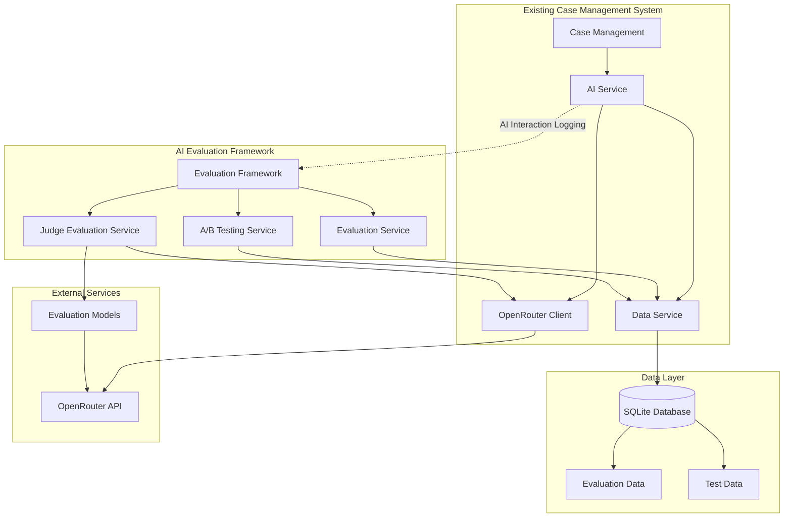

# AI Evaluation Framework Design Document

## Overview

The AI Evaluation Framework is a comprehensive system designed to ensure high-quality outputs from Large Language Models (LLMs) in the case management system. This framework builds upon the existing case management infrastructure to provide systematic evaluation, monitoring, and optimization of AI interactions through data capture, LLM-as-a-Judge evaluation, and A/B testing capabilities.

**Core Design Principles:**
- Leverage existing DataService and OpenRouterClient infrastructure
- Minimal performance impact on production AI operations
- Comprehensive data capture for evaluation dataset building
- Automated quality assessment with human oversight capabilities
- Statistical rigor in A/B testing and optimization
- Cost-effective evaluation with configurable evaluation models

## Implementation Status

### What Already Exists (Implemented)
- ✅ **Complete AI interaction logging**: `DataService.logAIInteraction()` captures all evaluation-relevant data
- ✅ **OpenRouter integration**: `OpenRouterClient` with retry logic, error handling, and multi-model support  
- ✅ **Database infrastructure**: SQLite with transactions, foreign keys, and comprehensive indexing
- ✅ **Case management**: Full case lifecycle with notes, summaries, and audit trails
- ✅ **API patterns**: RESTful endpoints with Zod validation and standardized error responses
- ✅ **TypeScript infrastructure**: Strict typing, interfaces, and validation patterns

### What Needs to be Implemented (New)
- 🔄 **EvaluationService**: Dataset management and evaluation orchestration
- 🔄 **JudgeEvaluationService**: LLM-as-a-Judge evaluation capabilities  
- 🔄 **ABTestingService**: A/B testing and statistical analysis
- 🔄 **Evaluation database tables**: New tables for datasets, evaluations, and test results
- 🔄 **Evaluation API endpoints**: REST endpoints for evaluation operations
- 🔄 **CLI scripts**: Command-line interface for evaluation operations

## Architecture

### High-Level Architecture



### Integration with Existing System

The AI Evaluation Framework integrates seamlessly with the existing case management system by extending the current architecture without modifying existing functionality:

**Data Capture Integration:**
- **Leverages existing `AIInteraction` logging**: The current `DataService.logAIInteraction()` method already captures comprehensive AI interaction data including prompt templates, model used, tokens, cost, duration, and success/failure status
- **Extends existing database schema**: Adds new evaluation-specific tables while maintaining foreign key relationships to existing `ai_interactions` table
- **Reuses existing `OpenRouterClient`**: Evaluation models (GPT-4, Claude, Grok) use the same OpenRouter integration for consistency
- **Maintains existing patterns**: Follows established TypeScript interfaces, Zod validation, and error handling patterns

**Service Layer Integration:**
- **`EvaluationService`** extends existing `DataService` patterns for dataset and evaluation management
- **`JudgeEvaluationService`** leverages existing `OpenRouterClient` for LLM-as-a-Judge evaluations with same retry logic and error handling
- **`ABTestingService`** integrates with existing `AIService` and `CaseService` for controlled experimentation
- **Reuses existing `PromptTemplateService`** for evaluation prompts (currently in `AIService`)
- **Integrates with existing audit trail**: Uses existing `DataService.logActivity()` for evaluation audit trails
- **Follows existing patterns**: Same TypeScript interfaces, Zod validation, and SQLite transaction patterns

**Frontend Integration:**
- Minimal frontend components for basic status monitoring
- Primary interaction through scripts and API endpoints
- Optional integration with existing React architecture for future expansion
- Focus on API-first design for maximum flexibility

## Script-Based Interaction Design

### CLI and Script Interface

The evaluation framework will be primarily operated through scripts and CLI commands, providing a developer-friendly interface for evaluation tasks:

**Dataset Management Scripts:**
```bash
# Create evaluation dataset from captured interactions
npm run eval:create-dataset --name="case-summaries" --operation="generate_summary" --days=30

# Add manual examples to dataset
npm run eval:add-example --dataset="case-summaries" --input-file="example.json" --expected-output-file="expected.json"

# List available datasets
npm run eval:list-datasets
```

**Evaluation Execution Scripts:**
```bash
# Run evaluation on dataset
npm run eval:run --dataset="case-summaries" --models="gpt-4,claude-3" --judge-model="gpt-4"

# Monitor evaluation progress
npm run eval:status --run-id="eval-123"

# Get evaluation results
npm run eval:results --run-id="eval-123" --format="json|csv"
```

**A/B Testing Scripts:**
```bash
# Create A/B test configuration
npm run abtest:create --config-file="test-config.json"

# Start A/B test
npm run abtest:start --test-id="test-123"

# Get test results
npm run abtest:results --test-id="test-123"
```

**Configuration Files:**
- JSON-based configuration for evaluation parameters
- YAML configuration for A/B test setups
- Environment-based configuration for evaluation models
- Template files for common evaluation scenarios

## Components and Interfaces

### Backend Services

#### EvaluationService

The EvaluationService serves as the central orchestrator for all evaluation activities in the framework. It manages evaluation datasets by creating, organizing, and maintaining collections of test examples that represent real-world AI interactions. This service coordinates the execution of evaluation runs, where multiple models and prompt configurations are systematically tested against curated datasets to measure performance, quality, and effectiveness. By integrating with the existing DataService, it seamlessly captures production AI interactions and transforms them into valuable evaluation datasets for continuous improvement.

```typescript
class EvaluationService {
  // Dataset management
  createDataset(config: CreateDatasetConfig): Promise<EvaluationDataset>
  addExampleToDataset(datasetId: string, example: EvaluationExample): Promise<void>
  getDataset(datasetId: string): Promise<EvaluationDataset | null>
  listDatasets(filters?: DatasetFilters): Promise<EvaluationDataset[]>
  
  // Evaluation execution
  runEvaluation(config: EvaluationConfig): Promise<EvaluationRun>
  getEvaluationRun(runId: string): Promise<EvaluationRun | null>
  listEvaluationRuns(filters?: EvaluationRunFilters): Promise<EvaluationRun[]>
  
  // Batch evaluation
  evaluateInteractions(interactionIds: string[], evaluationConfig: BatchEvaluationConfig): Promise<BatchEvaluationResult>
  
  // Dataset building from captured interactions
  buildDatasetFromInteractions(config: DatasetBuildConfig): Promise<EvaluationDataset>
  
  // Integration with existing services
  constructor(
    private dataService: DataService, // Existing DataService from backend/src/services/DataService.ts
    private judgeService: JudgeEvaluationService
  )
}
```

#### JudgeEvaluationService

The JudgeEvaluationService implements the "LLM-as-a-Judge" evaluation methodology, where sophisticated language models assess the quality of AI outputs using structured scoring criteria. This service provides automated, scalable quality assessment by leveraging advanced models like GPT-4, Claude, or Grok to evaluate AI responses across multiple dimensions including faithfulness, completeness, relevance, and clarity. It incorporates bias mitigation techniques such as chain-of-thought reasoning and few-shot examples to ensure consistent and fair evaluations, making it possible to assess AI quality at scale without requiring extensive human review.

```typescript
class JudgeEvaluationService {
  // LLM-as-a-Judge evaluation
  evaluateOutput(input: JudgeEvaluationInput): Promise<JudgeEvaluationResult>
  batchEvaluate(inputs: JudgeEvaluationInput[]): Promise<JudgeEvaluationResult[]>
  
  // Evaluation model management
  configureEvaluationModel(modelConfig: EvaluationModelConfig): void
  getAvailableEvaluationModels(): Promise<EvaluationModel[]>
  
  // Bias mitigation and consistency
  generateFewShotExamples(operation: string, count: number): Promise<FewShotExample[]>
  validateEvaluationConsistency(results: JudgeEvaluationResult[]): ConsistencyReport
  
  // Integration with existing services
  constructor(
    private openRouterClient: OpenRouterClient, // Existing OpenRouterClient from backend/src/services/OpenRouterClient.ts
    private aiService: AIService // Existing AIService contains prompt template functionality
  )
}
```

#### ABTestingService

The ABTestingService enables systematic experimentation and optimization of AI configurations through controlled A/B testing. This service manages the entire lifecycle of experiments, from creating test configurations with different prompt templates, models, and parameters, to randomly assigning users to test variants while maintaining statistical rigor. It provides comprehensive statistical analysis including confidence intervals, p-values, and effect sizes to determine which AI configurations perform better. The service also supports gradual rollout of winning configurations and rollback capabilities, ensuring that improvements can be deployed safely and systematically.

```typescript
class ABTestingService {
  // A/B test management
  createABTest(config: ABTestConfig): Promise<ABTest>
  startABTest(testId: string): Promise<void>
  stopABTest(testId: string): Promise<void>
  getABTest(testId: string): Promise<ABTest | null>
  listABTests(filters?: ABTestFilters): Promise<ABTest[]>
  
  // Test execution and assignment
  assignVariant(testId: string, userId: string, caseId?: string): Promise<TestVariant>
  recordTestInteraction(testId: string, variantId: string, interaction: TestInteraction): Promise<void>
  
  // Statistical analysis
  analyzeTestResults(testId: string): Promise<ABTestResults>
  calculateStatisticalSignificance(testId: string): Promise<StatisticalAnalysis>
  
  // Gradual rollout
  promoteWinningVariant(testId: string, rolloutPercentage: number): Promise<void>
  rollbackVariant(testId: string): Promise<void>
  
  // Integration with existing services
  constructor(
    private dataService: DataService, // Existing DataService
    private aiService: AIService, // Existing AIService  
    private caseService: CaseService, // Existing CaseService for case operations
    private judgeService: JudgeEvaluationService
  )
}
```


### Frontend Components

**Minimal Frontend Approach**: The initial implementation will focus on backend services and API endpoints, with minimal frontend components. Interaction will primarily be through scripts, CLI commands, and direct API calls for development and testing.

#### Basic Evaluation Status Component (Optional)
```typescript
interface EvaluationStatusProps {
  className?: string
}

// Simple status display for ongoing evaluations
// Features:
// - Show active evaluation runs
// - Display basic progress information
// - Link to detailed API responses
```

**Script-Based Interaction**: Primary interaction will be through:
- Node.js scripts for dataset creation and management
- CLI commands for running evaluations
- Direct API calls for A/B test configuration
- JSON configuration files for evaluation parameters
- Console output for results and progress monitoring


### API Endpoints

#### Evaluation Management Endpoints
```
POST   /api/evaluation/datasets                    # Create evaluation dataset
GET    /api/evaluation/datasets                    # List evaluation datasets
GET    /api/evaluation/datasets/:id               # Get dataset details
POST   /api/evaluation/datasets/:id/examples      # Add example to dataset
DELETE /api/evaluation/datasets/:id               # Delete dataset

POST   /api/evaluation/runs                       # Start evaluation run
GET    /api/evaluation/runs                       # List evaluation runs
GET    /api/evaluation/runs/:id                   # Get evaluation run details
POST   /api/evaluation/runs/:id/stop              # Stop evaluation run
```

#### A/B Testing Endpoints
```
POST   /api/abtests                               # Create A/B test
GET    /api/abtests                               # List A/B tests
GET    /api/abtests/:id                           # Get A/B test details
POST   /api/abtests/:id/start                     # Start A/B test
POST   /api/abtests/:id/stop                      # Stop A/B test
GET    /api/abtests/:id/results                   # Get test results
POST   /api/abtests/:id/promote                   # Promote winning variant
```


#### Judge Evaluation Endpoints
```
POST   /api/judge/evaluate                        # Evaluate single output
POST   /api/judge/batch-evaluate                  # Batch evaluate outputs
GET    /api/judge/models                          # Get available evaluation models
POST   /api/judge/configure                       # Configure evaluation model
```

## Data Models

### Existing Models (From Case Management System)

The evaluation framework leverages these existing, implemented models:

```typescript
// Already implemented in backend/src/types/index.ts
interface AIInteraction {
  id: string
  caseId: string
  operation: 'generate_summary' | 'generate_recommendation' | 'analyze_application' | 'generate_final_summary' | 'validate_completeness' | 'detect_missing_fields'
  prompt: string
  response: string
  model: string
  tokensUsed: number
  cost?: number
  duration: number
  success: boolean
  error?: string
  timestamp: Date
  stepContext?: ProcessStep
  promptTemplate?: string
  promptVersion?: string
}

interface Case {
  id: string
  applicationData: ApplicationData
  status: CaseStatus
  currentStep: ProcessStep
  createdAt: Date
  updatedAt: Date
  assignedTo?: string
  notes: CaseNote[]
  aiSummaries: AISummary[]
  auditTrail: AuditEntry[]
}

interface ApplicationData {
  applicantName: string
  applicantEmail: string
  applicationType: string
  submissionDate: Date
  documents: CaseDocument[]
  formData: Record<string, any>
}
```

### New Evaluation Framework Models

#### EvaluationDataset
```typescript
interface EvaluationDataset {
  id: string
  name: string
  description: string
  operation: AIOperation
  examples: EvaluationExample[]
  metadata: {
    createdBy: string
    createdAt: Date
    updatedAt: Date
    version: number
    tags: string[]
    difficulty: 'easy' | 'medium' | 'hard'
    sourceType: 'manual' | 'captured_interactions' | 'synthetic'
  }
  statistics: {
    totalExamples: number
    averageQuality: number
    difficultyDistribution: Record<string, number>
  }
}
```

#### EvaluationExample
```typescript
interface EvaluationExample {
  id: string
  datasetId: string
  input: {
    caseData?: Case
    applicationData?: ApplicationData
    step?: ProcessStep
    context?: Record<string, any>
    prompt?: string
  }
  expectedOutput: {
    content: string
    quality: number // 1-10 scale
    criteria: {
      faithfulness: number
      completeness: number
      relevance: number
      clarity: number
      taskSpecific?: Record<string, number>
    }
  }
  metadata: {
    tags: string[]
    difficulty: 'easy' | 'medium' | 'hard'
    createdAt: Date
    sourceInteractionId?: string
    notes?: string
  }
}
```

#### JudgeEvaluationResult
```typescript
interface JudgeEvaluationResult {
  id: string
  interactionId: string
  evaluationModel: string
  scores: {
    overall: number // 1-10 scale
    faithfulness: number
    completeness: number
    relevance: number
    clarity: number
    taskSpecific?: Record<string, number>
  }
  reasoning: {
    overall: string
    faithfulness: string
    completeness: string
    relevance: string
    clarity: string
    taskSpecific?: Record<string, string>
  }
  metadata: {
    evaluatedAt: Date
    evaluationDuration: number
    evaluationCost: number
    evaluationTokens: number
    confidence: number
    flags: string[] // e.g., ['low_confidence', 'potential_bias']
  }
}
```

#### ABTest
```typescript
interface ABTest {
  id: string
  name: string
  description: string
  operation: AIOperation
  status: 'draft' | 'running' | 'completed' | 'stopped'
  variants: TestVariant[]
  trafficSplit: Record<string, number> // variant ID -> percentage
  config: {
    successMetrics: string[]
    duration: number // days
    sampleSize: number
    significanceLevel: number // e.g., 0.05
    minimumDetectableEffect: number
  }
  metadata: {
    createdBy: string
    createdAt: Date
    startedAt?: Date
    completedAt?: Date
    tags: string[]
  }
}
```

#### TestVariant
```typescript
interface TestVariant {
  id: string
  testId: string
  name: string
  description: string
  config: {
    promptTemplate: string
    model: string
    parameters: Record<string, any>
  }
  metrics: {
    sampleSize: number
    qualityScore: number
    responseTime: number
    cost: number
    userSatisfaction: number
    successRate: number
  }
  status: 'active' | 'paused' | 'winner' | 'loser'
}
```

#### EvaluationRun
```typescript
interface EvaluationRun {
  id: string
  name: string
  datasetId: string
  config: {
    models: string[]
    promptTemplates: string[]
    parameters: Record<string, any>
    evaluationModel: string
    sampleSize?: number
  }
  status: 'queued' | 'running' | 'completed' | 'failed' | 'cancelled'
  progress: {
    totalExamples: number
    completedExamples: number
    failedExamples: number
    estimatedTimeRemaining?: number
  }
  results: EvaluationRunResult[]
  summary: {
    averageQuality: number
    averageSpeed: number
    totalCost: number
    bestPerformingModel: string
    recommendations: string[]
  }
  metadata: {
    createdBy: string
    startedAt: Date
    completedAt?: Date
    duration?: number
  }
}
```

#### EvaluationRunResult
```typescript
interface EvaluationRunResult {
  id: string
  runId: string
  exampleId: string
  model: string
  promptTemplate: string
  parameters: Record<string, any>
  response: string
  judgeEvaluation: JudgeEvaluationResult
  metrics: {
    responseTime: number
    tokenUsage: number
    cost: number
  }
  timestamp: Date
}
```

### Extended Models for User Feedback

#### UserFeedback
```typescript
interface UserFeedback {
  id: string
  interactionId: string
  userId: string
  rating: 'thumbs_up' | 'thumbs_down'
  qualityScore: number // 1-10 scale
  feedback: string
  categories: ('accuracy' | 'completeness' | 'relevance' | 'clarity' | 'usefulness')[]
  metadata: {
    timestamp: Date
    sessionId: string
    caseId?: string
    step?: ProcessStep
  }
}
```

#### FeedbackAggregation
```typescript
interface FeedbackAggregation {
  interactionId: string
  operation: AIOperation
  model: string
  promptTemplate: string
  aggregatedRating: number // 1-10 scale
  totalFeedback: number
  positiveRatio: number
  categoryScores: Record<string, number>
  commonIssues: string[]
  trends: {
    period: string
    rating: number
    volume: number
  }[]
}
```

## Database Schema Extensions

### Design Alignment Note

**Important**: The existing case management design document (`.kiro/specs/ai-case-management/design.md`) contains evaluation-related models that were design artifacts but never implemented. These models (EvaluationDataset, EvaluationExample, EvaluationConfig, etc.) should be considered part of this AI evaluation framework specification, not the case management system.

### Current Database Schema

The existing case management system has the following tables that the evaluation framework will leverage:

**Existing Tables (Already Implemented):**
- `cases` - Core case data with application information
- `ai_summaries` - AI-generated summaries and recommendations  
- `case_notes` - Manual case notes and updates
- `audit_trail` - Activity logging and audit information
- `ai_interactions` - **Critical for evaluation**: Comprehensive AI interaction logging including prompts, responses, models, tokens, cost, duration, success/failure, prompt templates, and versions

**Key Integration Point**: The existing `ai_interactions` table already captures all the data needed for evaluation dataset building, including:
- Complete prompt and response pairs
- Model and parameter information
- Performance metrics (tokens, cost, duration)
- Success/failure status and error details
- Prompt template and version tracking
- Case context and operation type

### New Evaluation Framework Tables

#### Evaluation Datasets Table
```sql
CREATE TABLE evaluation_datasets (
  id TEXT PRIMARY KEY,
  name TEXT NOT NULL,
  description TEXT,
  operation TEXT NOT NULL,
  metadata TEXT NOT NULL, -- JSON serialized metadata
  statistics TEXT, -- JSON serialized statistics
  created_at DATETIME DEFAULT CURRENT_TIMESTAMP,
  updated_at DATETIME DEFAULT CURRENT_TIMESTAMP
);
```

#### Evaluation Examples Table
```sql
CREATE TABLE evaluation_examples (
  id TEXT PRIMARY KEY,
  dataset_id TEXT NOT NULL,
  input_data TEXT NOT NULL, -- JSON serialized input
  expected_output TEXT NOT NULL, -- JSON serialized expected output
  metadata TEXT, -- JSON serialized metadata
  created_at DATETIME DEFAULT CURRENT_TIMESTAMP,
  FOREIGN KEY (dataset_id) REFERENCES evaluation_datasets(id) ON DELETE CASCADE
);
```

#### Judge Evaluations Table
```sql
CREATE TABLE judge_evaluations (
  id TEXT PRIMARY KEY,
  interaction_id TEXT NOT NULL,
  evaluation_model TEXT NOT NULL,
  scores TEXT NOT NULL, -- JSON serialized scores
  reasoning TEXT NOT NULL, -- JSON serialized reasoning
  metadata TEXT, -- JSON serialized metadata
  created_at DATETIME DEFAULT CURRENT_TIMESTAMP,
  FOREIGN KEY (interaction_id) REFERENCES ai_interactions(id) ON DELETE CASCADE
);
```

#### AB Tests Table
```sql
CREATE TABLE ab_tests (
  id TEXT PRIMARY KEY,
  name TEXT NOT NULL,
  description TEXT,
  operation TEXT NOT NULL,
  status TEXT NOT NULL CHECK (status IN ('draft', 'running', 'completed', 'stopped')),
  config TEXT NOT NULL, -- JSON serialized config
  metadata TEXT, -- JSON serialized metadata
  created_at DATETIME DEFAULT CURRENT_TIMESTAMP,
  started_at DATETIME,
  completed_at DATETIME
);
```

#### Test Variants Table
```sql
CREATE TABLE test_variants (
  id TEXT PRIMARY KEY,
  test_id TEXT NOT NULL,
  name TEXT NOT NULL,
  description TEXT,
  config TEXT NOT NULL, -- JSON serialized config
  metrics TEXT, -- JSON serialized metrics
  status TEXT NOT NULL CHECK (status IN ('active', 'paused', 'winner', 'loser')),
  created_at DATETIME DEFAULT CURRENT_TIMESTAMP,
  FOREIGN KEY (test_id) REFERENCES ab_tests(id) ON DELETE CASCADE
);
```

#### Evaluation Runs Table
```sql
CREATE TABLE evaluation_runs (
  id TEXT PRIMARY KEY,
  name TEXT NOT NULL,
  dataset_id TEXT NOT NULL,
  config TEXT NOT NULL, -- JSON serialized config
  status TEXT NOT NULL CHECK (status IN ('queued', 'running', 'completed', 'failed', 'cancelled')),
  progress TEXT, -- JSON serialized progress
  summary TEXT, -- JSON serialized summary
  metadata TEXT, -- JSON serialized metadata
  created_at DATETIME DEFAULT CURRENT_TIMESTAMP,
  started_at DATETIME,
  completed_at DATETIME,
  FOREIGN KEY (dataset_id) REFERENCES evaluation_datasets(id) ON DELETE CASCADE
);
```

#### Evaluation Run Results Table
```sql
CREATE TABLE evaluation_run_results (
  id TEXT PRIMARY KEY,
  run_id TEXT NOT NULL,
  example_id TEXT NOT NULL,
  model TEXT NOT NULL,
  prompt_template TEXT NOT NULL,
  parameters TEXT, -- JSON serialized parameters
  response TEXT NOT NULL,
  judge_evaluation_id TEXT,
  metrics TEXT, -- JSON serialized metrics
  created_at DATETIME DEFAULT CURRENT_TIMESTAMP,
  FOREIGN KEY (run_id) REFERENCES evaluation_runs(id) ON DELETE CASCADE,
  FOREIGN KEY (example_id) REFERENCES evaluation_examples(id),
  FOREIGN KEY (judge_evaluation_id) REFERENCES judge_evaluations(id)
);
```

#### User Feedback Table
```sql
CREATE TABLE user_feedback (
  id TEXT PRIMARY KEY,
  interaction_id TEXT NOT NULL,
  user_id TEXT NOT NULL,
  rating TEXT NOT NULL CHECK (rating IN ('thumbs_up', 'thumbs_down')),
  quality_score INTEGER CHECK (quality_score >= 1 AND quality_score <= 10),
  feedback TEXT,
  categories TEXT, -- JSON array
  metadata TEXT, -- JSON serialized metadata
  created_at DATETIME DEFAULT CURRENT_TIMESTAMP,
  FOREIGN KEY (interaction_id) REFERENCES ai_interactions(id) ON DELETE CASCADE
);
```

### Database Indexes for Performance
```sql
-- Evaluation framework indexes
CREATE INDEX idx_evaluation_examples_dataset_id ON evaluation_examples(dataset_id);
CREATE INDEX idx_judge_evaluations_interaction_id ON judge_evaluations(interaction_id);
CREATE INDEX idx_ab_tests_status ON ab_tests(status);
CREATE INDEX idx_test_variants_test_id ON test_variants(test_id);
CREATE INDEX idx_evaluation_runs_dataset_id ON evaluation_runs(dataset_id);
CREATE INDEX idx_evaluation_runs_status ON evaluation_runs(status);
CREATE INDEX idx_evaluation_run_results_run_id ON evaluation_run_results(run_id);
CREATE INDEX idx_user_feedback_interaction_id ON user_feedback(interaction_id);
CREATE INDEX idx_user_feedback_user_id ON user_feedback(user_id);
CREATE INDEX idx_user_feedback_created_at ON user_feedback(created_at);
```

## Integration Points

### Data Capture Integration

The evaluation framework seamlessly integrates with the existing AI interaction logging:

**Enhanced AIInteraction Logging:**
```typescript
// Existing AIInteraction model is extended with evaluation metadata
interface AIInteraction {
  // ... existing fields
  evaluationMetadata?: {
    datasetEligible: boolean
    qualityFlags: string[]
    userFeedbackId?: string
    judgeEvaluationId?: string
    abTestId?: string
    variantId?: string
  }
}
```

**Automatic Dataset Building:**
- Captured AI interactions can be automatically converted to evaluation examples
- Quality thresholds and filtering rules determine dataset eligibility
- Human review and curation workflows for dataset quality

### Prompt Template Integration

**Extended PromptTemplateService:**
```typescript
class PromptTemplateService {
  // ... existing methods
  
  // Evaluation-specific templates
  generateJudgePrompt(evaluationType: string, criteria: string[]): string
  generateFewShotExamples(operation: string, count: number): FewShotExample[]
  validateEvaluationPrompt(template: string): ValidationResult
}
```

**Evaluation Prompt Templates:**
- `judge_evaluation_v1`: LLM-as-a-Judge evaluation prompts
- `bias_mitigation_v1`: Bias detection and mitigation prompts
- `consistency_check_v1`: Evaluation consistency validation prompts

### Cost Management Integration

**Cost Tracking for Evaluations:**
- Separate cost tracking for evaluation operations
- Budget controls and alerts for evaluation spending
- Cost optimization recommendations based on evaluation ROI

## Error Handling and Reliability

### Evaluation-Specific Error Handling

**Judge Evaluation Errors:**
- Fallback to alternative evaluation models
- Retry logic with exponential backoff
- Quality checks for evaluation consistency
- Human review triggers for low-confidence evaluations

**A/B Testing Errors:**
- Automatic test stopping on critical errors
- Variant rollback capabilities
- Statistical validity checks and warnings
- Data integrity validation for test results

**Dataset Management Errors:**
- Validation of evaluation examples
- Duplicate detection and handling
- Data quality checks and alerts
- Backup and recovery for evaluation datasets

## Security and Privacy

### Evaluation Data Security

**Data Protection:**
- Evaluation datasets follow same security patterns as case data
- PII anonymization in evaluation examples
- Secure storage of evaluation results and metrics
- Access controls for evaluation framework features

**Model Security:**
- Secure API key management for evaluation models
- Input sanitization for evaluation prompts
- Response validation for evaluation results
- Audit trails for all evaluation activities

## Performance Considerations

### Evaluation Performance

**Asynchronous Processing:**
- Background evaluation runs with progress tracking
- Queue-based evaluation processing
- Batch evaluation optimization
- Resource usage monitoring and throttling

**Caching and Optimization:**
- Evaluation result caching for repeated assessments
- Prompt template caching for performance
- Database query optimization for metrics
- Efficient data aggregation for reporting

### Scalability

**Horizontal Scaling:**
- Distributed evaluation processing capability
- Load balancing for evaluation requests
- Database partitioning for large datasets
- Efficient data archival and cleanup

## Testing Strategy

### Evaluation Framework Testing

**Unit Testing:**
- Individual service testing with mocked dependencies
- Evaluation algorithm testing with known datasets
- Statistical analysis validation
- Error handling and edge case testing

**Integration Testing:**
- End-to-end evaluation workflow testing
- A/B testing statistical accuracy validation
- Database integration and performance testing
- API endpoint testing with realistic data

**Performance Testing:**
- Large-scale evaluation run testing
- Concurrent A/B test execution testing
- Database performance under evaluation load
- Memory and resource usage optimization

## Deployment and Operations

### Monitoring and Alerting

**Evaluation Monitoring:**
- Evaluation run success/failure rates
- Judge evaluation consistency monitoring
- A/B test statistical validity alerts
- Cost and resource usage monitoring

**Quality Monitoring:**
- AI output quality trend monitoring
- User satisfaction tracking
- Performance regression detection
- Anomaly detection in evaluation metrics

### Maintenance and Updates

**Framework Maintenance:**
- Regular evaluation model updates
- Dataset quality maintenance
- Performance optimization
- Security updates and patches

**Operational Procedures:**
- Evaluation framework backup procedures
- Disaster recovery for evaluation data
- Capacity planning for evaluation workloads
- Documentation and training materials