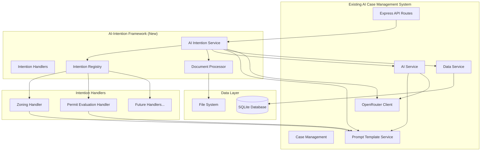

# Design Document

## Overview

The AI-intention system provides a generalized framework for processing documents through Large Language Models (LLMs) with structured output deserialization. The system extends the existing AI Case Management architecture by adding configurable "intention handlers" that define prompts, input processing logic, and output data models for specific document processing use cases.

The initial implementation focuses on two city planning use cases:
1. **Zoning Requirements Extraction**: Processing zoning plan PDFs to extract structured requirements
2. **Permit Compliance Evaluation**: Evaluating building permit applications against extracted zoning requirements

The system integrates seamlessly with the existing infrastructure, leveraging the current OpenRouter integration, PromptTemplateService, DataService, and established API patterns.

## Architecture

### Integration with Existing System



### System Flow

1. **Document Input**: PDFs are uploaded to a specified folder location via API endpoint
2. **Handler Selection**: AIIntentionService selects appropriate intention handler based on request type
3. **Document Processing**: DocumentProcessor extracts text content from PDFs using existing file handling patterns
4. **AI Processing**: Handler constructs prompts using PromptTemplateService and sends to LLM via existing OpenRouterClient
5. **Response Deserialization**: JSON responses are validated using Zod schemas (following existing patterns)
6. **Result Storage**: Processed results are stored in database using existing DataService with audit trail

## Components and Interfaces

### 1. AI Intention Service (Main Orchestrator)

```typescript
class AIIntentionService {
  constructor(
    private aiService: AIService,           // Existing AIService
    private promptTemplateService: PromptTemplateService, // Existing service
    private dataService: DataService,       // Existing DataService
    private openRouterClient: OpenRouterClient, // Existing client
    private documentProcessor: DocumentProcessor,
    private intentionRegistry: IntentionRegistry
  ) {}

  // Main processing method
  async processIntention<TOutput>(
    intentionId: string, 
    folderPath: string, 
    options?: ProcessingOptions
  ): Promise<IntentionResult<TOutput>>

  // Status and management
  async getIntentionStatus(processId: string): Promise<ProcessingStatus>
  async listAvailableIntentions(): Promise<IntentionHandlerInfo[]>
}
```

### 2. Intention Handler Interface (Following Existing Patterns)

```typescript
interface IntentionHandler<TInput, TOutput> {
  readonly id: string;
  readonly name: string;
  readonly description: string;
  readonly version: string;
  
  // Configuration (integrates with existing PromptTemplateService)
  getPromptTemplateId(): string;
  getOutputSchema(): z.ZodSchema<TOutput>;
  getInputRequirements(): InputRequirements;
  
  // Processing (follows existing AIService patterns)
  processDocuments(folderPath: string): Promise<TInput>;
  executeIntention(input: TInput, aiService: AIService): Promise<TOutput>;
  validateOutput(response: string): ValidationResult<TOutput>;
}
```

### 3. Document Processor (New Component)

```typescript
class DocumentProcessor {
  // PDF text extraction
  async extractTextFromPDF(filePath: string): Promise<string>
  
  // Folder processing (follows existing file handling patterns)
  async processFolder(
    folderPath: string, 
    fileFilter?: (filename: string) => boolean
  ): Promise<DocumentContent[]>
  
  // Validation (follows existing validation patterns)
  async validateDocumentFormat(filePath: string): Promise<boolean>
}
```

### 4. Intention Registry (Following Service Factory Pattern)

```typescript
class IntentionRegistry {
  private handlers: Map<string, IntentionHandler<any, any>> = new Map();

  // Handler management (follows existing service registration patterns)
  registerHandler<T extends IntentionHandler<any, any>>(handler: T): void
  getHandler(intentionId: string): IntentionHandler<any, any> | null
  listHandlers(): IntentionHandlerInfo[]
  validateHandler(handler: IntentionHandler<any, any>): ValidationResult
}

## Data Models

### Core Framework Models (Following Existing Patterns)

```typescript
// Follows existing AIInteraction and Case patterns
interface IntentionResult<T> {
  id: string;
  intentionId: string;
  input: {
    folderPath: string;
    documentsProcessed: string[];
    processingTimestamp: Date;
  };
  output: T;
  metadata: {
    processingTime: number;
    tokensUsed: number;
    model: string;
    confidence?: number;
    cost?: number; // Following existing cost tracking
  };
  status: 'success' | 'partial_success' | 'failed';
  errors?: ProcessingError[];
}

// Follows existing ErrorResponse pattern
interface ProcessingError {
  type: 'document_processing' | 'ai_processing' | 'validation' | 'deserialization';
  message: string;
  details?: Record<string, any>;
  documentPath?: string;
}

// Follows existing CaseDocument pattern
interface DocumentContent {
  filename: string;
  path: string;
  content: string;
  metadata: {
    size: number;
    mimeType: string;
    extractedAt: Date;
  };
}

// New model for intention processing audit trail
interface IntentionInteraction {
  id: string;
  intentionId: string;
  operation: string;
  prompt: string;
  response: string;
  model: string;
  tokensUsed: number;
  cost?: number;
  duration: number;
  success: boolean;
  error?: string;
  timestamp: Date;
  promptTemplate?: string;
  promptVersion?: string;
  folderPath?: string;
  documentsProcessed?: string[];
}
```

### Zoning Requirements Models

```typescript
interface ZoningRequirement {
  id: string;
  category: string;
  title: string;
  description: string;
  mandatory: boolean;
  criteria: RequirementCriteria[];
  references: DocumentReference[];
}

interface RequirementCriteria {
  type: 'numeric' | 'boolean' | 'text' | 'selection';
  field: string;
  operator?: 'equals' | 'greater_than' | 'less_than' | 'contains';
  value: any;
  unit?: string;
}

interface ZoningPlanRequirements {
  planId: string;
  planName: string;
  jurisdiction: string;
  effectiveDate: Date;
  requirements: ZoningRequirement[];
  extractedFrom: string[];
  extractedAt: Date;
}
```

### Permit Evaluation Models

```typescript
interface PermitEvaluation {
  permitId: string;
  applicantName: string;
  evaluationDate: Date;
  overallCompliance: 'compliant' | 'non_compliant' | 'requires_review';
  requirementEvaluations: RequirementEvaluation[];
  summary: string;
  recommendedActions: string[];
}

interface RequirementEvaluation {
  requirementId: string;
  requirementTitle: string;
  status: 'met' | 'not_met' | 'partially_met' | 'not_applicable';
  evidence: string;
  explanation: string;
  confidence: number;
}
```

## Error Handling

### Error Categories

1. **Document Processing Errors**
   - File not found or inaccessible
   - Unsupported file format
   - PDF extraction failures
   - Corrupted documents

2. **AI Processing Errors**
   - OpenRouter API failures
   - Token limit exceeded
   - Model unavailable
   - Rate limiting

3. **Validation Errors**
   - Invalid JSON response format
   - Schema validation failures
   - Missing required fields
   - Type conversion errors

4. **System Errors**
   - Database connection issues
   - File system permissions
   - Memory limitations
   - Network connectivity

### Error Recovery Strategies

- **Retry Logic**: Exponential backoff for transient failures
- **Fallback Processing**: Alternative models or simplified prompts
- **Partial Results**: Return successfully processed items when some fail
- **Detailed Logging**: Comprehensive error tracking for debugging

## Testing Strategy (Following Existing Patterns)

### Unit Tests (Using Existing Vitest Setup)

- **Handler Registration**: Validate handler configuration and registration (follows existing service tests)
- **Document Processing**: Test PDF text extraction with various formats
- **Output Validation**: Verify Zod schema validation and deserialization (follows existing validation patterns)
- **Error Handling**: Test all error scenarios and recovery mechanisms (follows existing error handling tests)
- **Prompt Template Integration**: Test integration with existing PromptTemplateService

### Integration Tests (Following Existing API Test Patterns)

- **End-to-End Processing**: Complete intention processing workflows (follows existing case processing tests)
- **OpenRouter Integration**: AI service interaction testing (leverages existing OpenRouterClient tests)
- **Database Operations**: Result storage and retrieval using existing DataService patterns
- **File System Operations**: Document folder processing with proper error handling

### Test Data (Following Existing Test Data Patterns)

- **Sample PDFs**: Various zoning plan and permit application formats
- **Mock Responses**: Predefined AI responses for consistent testing (follows existing AI service mocks)
- **Error Scenarios**: Malformed documents and API failures (follows existing error test patterns)
- **Performance Tests**: Large document sets and concurrent processing

### API Testing (Using Existing Supertest Setup)

- **REST Endpoints**: All intention processing endpoints (follows existing `/api/cases` and `/api/ai` patterns)
- **Status Tracking**: Processing status and progress endpoints
- **Error Responses**: Proper HTTP status codes and ErrorResponse format (follows existing patterns)
- **Input Validation**: Zod schema validation for all endpoints (follows existing validation patterns)

## API Endpoints (Following Existing Patterns)

### Intention Processing Endpoints

```typescript
// Following existing /api/cases and /api/ai patterns
POST   /api/intentions/process              # Process documents with specific intention
GET    /api/intentions                      # List available intention handlers
GET    /api/intentions/:id                  # Get intention handler details
GET    /api/intentions/results/:processId   # Get processing results
POST   /api/intentions/validate             # Validate documents before processing
```

### API Request/Response Format (Following Existing Patterns)

```typescript
// Request format (follows existing validation patterns)
interface ProcessIntentionRequest {
  intentionId: string;
  folderPath: string;
  options?: {
    fileFilter?: string;
    maxFiles?: number;
    timeout?: number;
  };
}

// Response format (follows existing success/error response patterns)
interface ProcessIntentionResponse {
  success: true;
  data: {
    processId: string;
    result: IntentionResult<any>;
  };
  message: string;
  timestamp: string;
}

// Error response (follows existing ErrorResponse format)
interface IntentionErrorResponse {
  error: {
    code: string;
    message: string;
    details?: any;
  };
  timestamp: string;
  requestId: string;
}
```

## Implementation Phases

### Phase 1: Core Framework Integration
- Extend existing PromptTemplateService with intention-specific templates
- Implement DocumentProcessor using existing file handling patterns
- Create IntentionRegistry following existing service factory patterns
- Integrate with existing DataService for audit logging

### Phase 2: Zoning Requirements Handler
- Implement ZoningHandler following existing handler patterns
- Create zoning-specific prompt templates in PromptTemplateService
- Add zoning requirement data models to existing types
- Integrate with existing validation and error handling

### Phase 3: Permit Evaluation Handler
- Implement PermitEvaluationHandler following established patterns
- Create permit evaluation prompt templates
- Add permit evaluation data models
- Implement comparative analysis using existing AI service patterns

### Phase 4: API Integration
- Add intention endpoints to existing Express router setup
- Integrate with existing middleware (validation, error handling, logging)
- Add intention processing to existing database schema
- Extend existing test suites with intention-specific tests