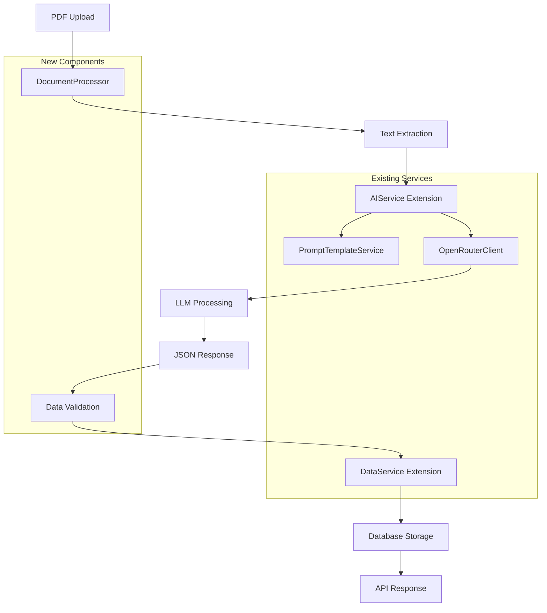

# Designdokument

## Oversikt

The zoning requirements extraction feature extends the existing AI Case Management System to process PDF documents containing zoning plans and extract structured requirements data using OpenRouter LLM services. The design integrates seamlessly with existing services (AIService, DataService, PromptTemplateService) while adding new data models and database tables specifically for zoning requirements management.

## Architecture

### High-Level Architecture



### Service Integration

The feature extends existing services following established patterns:

- **AIService**: New method `extractZoningRequirements()` following existing AI operation patterns
- **DataService**: New methods for zoning requirements CRUD operations following existing data patterns
- **PromptTemplateService**: New template `zoning_requirements_extraction_v1` following existing template patterns
- **ServiceFactory**: Updated to include DocumentProcessor in service container
- **Routes**: New `/api/zoning` router following existing route patterns (cases.ts, ai.ts)

## Components and Interfaces

### New Data Models

#### ZoningRequirement Interface
```typescript
export interface ZoningRequirement {
  id: string;
  planId: string;
  category: string;
  subcategory?: string;
  requirement: string;
  description: string;
  criteria: RequirementCriteria[];
  references: string[];
  priority: 'required' | 'recommended' | 'optional';
  applicableZones: string[];
  createdAt: Date;
  updatedAt: Date;
}
```

#### ZoningPlan Interface
```typescript
export interface ZoningPlan {
  id: string;
  name: string;
  documentPath: string;
  documentHash: string;
  jurisdiction: string;
  effectiveDate: Date;
  version: string;
  requirements: ZoningRequirement[];
  extractionMetadata: ExtractionMetadata;
  createdAt: Date;
  updatedAt: Date;
}
```

#### RequirementCriteria Interface
```typescript
export interface RequirementCriteria {
  id: string;
  type: 'numeric' | 'boolean' | 'text' | 'selection';
  name: string;
  description: string;
  value?: string | number | boolean;
  unit?: string;
  validValues?: string[];
  minValue?: number;
  maxValue?: number;
}
```

#### ExtractionMetadata Interface
```typescript
export interface ExtractionMetadata {
  extractedAt: Date;
  aiModel: string;
  promptTemplate: string;
  promptVersion: string;
  confidence: number;
  tokensUsed: number;
  processingDuration: number;
  documentPages: number;
  extractedRequirementsCount: number;
}
```

### DocumentProcessor Service

New service following existing service patterns, integrated with ServiceFactory:

```typescript
export class DocumentProcessor {
  async extractTextFromPDF(filePath: string): Promise<string>;
  async processFolder(folderPath: string): Promise<ProcessingResult[]>;
  async validateDocument(filePath: string): Promise<ValidationResult>;
  private calculateDocumentHash(filePath: string): Promise<string>;
}

// ServiceFactory integration
export interface ServiceContainer {
  caseService: CaseService;
  dataService: DataService;
  aiService: AIService;
  documentProcessor: DocumentProcessor; // New service added
}
```

### AIService Extensions

New methods added to existing AIService following established patterns:

```typescript
// Added to existing AIService class
async extractZoningRequirements(
  documentText: string, 
  documentMetadata: DocumentMetadata
): Promise<ZoningPlan>;

async batchProcessZoningDocuments(
  folderPath: string
): Promise<BatchProcessingResult>;

// AIInteraction operation types extended
export type AIOperation = 
  | 'generate_summary' 
  | 'generate_recommendation' 
  | 'analyze_application' 
  | 'generate_final_summary' 
  | 'validate_completeness' 
  | 'detect_missing_fields'
  | 'extract_zoning_requirements'  // New operation
  | 'batch_process_zoning';        // New operation
```

### DataService Extensions

New methods added to existing DataService:

```typescript
// Added to existing DataService class
async saveZoningPlan(plan: ZoningPlan): Promise<void>;
async getZoningPlan(planId: string): Promise<ZoningPlan | null>;
async getZoningRequirements(planId: string): Promise<ZoningRequirement[]>;
async searchZoningRequirements(criteria: SearchCriteria): Promise<ZoningRequirement[]>;
async updateZoningRequirement(requirementId: string, updates: Partial<ZoningRequirement>): Promise<void>;
```

## Data Models

### Database Schema Extensions

#### zoning_plans Table
```sql
CREATE TABLE zoning_plans (
  id TEXT PRIMARY KEY,
  name TEXT NOT NULL,
  document_path TEXT NOT NULL,
  document_hash TEXT NOT NULL UNIQUE,
  jurisdiction TEXT NOT NULL,
  effective_date DATETIME NOT NULL,
  version TEXT NOT NULL,
  extraction_metadata TEXT NOT NULL,
  created_at DATETIME DEFAULT CURRENT_TIMESTAMP,
  updated_at DATETIME DEFAULT CURRENT_TIMESTAMP
);
```

#### zoning_requirements Table
```sql
CREATE TABLE zoning_requirements (
  id TEXT PRIMARY KEY,
  plan_id TEXT NOT NULL,
  category TEXT NOT NULL,
  subcategory TEXT,
  requirement TEXT NOT NULL,
  description TEXT NOT NULL,
  criteria TEXT NOT NULL, -- JSON array of RequirementCriteria
  references TEXT NOT NULL, -- JSON array of strings
  priority TEXT NOT NULL CHECK (priority IN ('required', 'recommended', 'optional')),
  applicable_zones TEXT NOT NULL, -- JSON array of strings
  created_at DATETIME DEFAULT CURRENT_TIMESTAMP,
  updated_at DATETIME DEFAULT CURRENT_TIMESTAMP,
  FOREIGN KEY (plan_id) REFERENCES zoning_plans(id) ON DELETE CASCADE
);
```

#### Indexes
```sql
CREATE INDEX idx_zoning_plans_jurisdiction ON zoning_plans(jurisdiction);
CREATE INDEX idx_zoning_plans_effective_date ON zoning_plans(effective_date);
CREATE INDEX idx_zoning_plans_document_hash ON zoning_plans(document_hash);
CREATE INDEX idx_zoning_requirements_plan_id ON zoning_requirements(plan_id);
CREATE INDEX idx_zoning_requirements_category ON zoning_requirements(category);
CREATE INDEX idx_zoning_requirements_priority ON zoning_requirements(priority);
```

### AI Interaction Extensions

Extend existing ai_interactions table operation enum following schema patterns:
```sql
-- Update existing CHECK constraint in schema.ts
-- In createAIInteractionsTable method:
operation TEXT NOT NULL CHECK (operation IN (
  'generate_summary', 'generate_recommendation', 'analyze_application', 
  'generate_final_summary', 'validate_completeness', 'detect_missing_fields',
  'extract_zoning_requirements', 'batch_process_zoning'
))
```

### API Routes

New `/api/zoning` router following existing patterns:

```typescript
// routes/zoning.ts - following cases.ts and ai.ts patterns
router.post('/extract', validateInput(extractZoningSchema), asyncHandler(...));
router.post('/batch-process', validateInput(batchProcessSchema), asyncHandler(...));
router.get('/plans', asyncHandler(...));
router.get('/plans/:id', validateZoningPlanId, asyncHandler(...));
router.get('/plans/:id/requirements', validateZoningPlanId, asyncHandler(...));

// Added to index.ts
import zoningRouter from './routes/zoning.js';
app.use('/api/zoning', zoningRouter);
```

## Error Handling

### Error Handling Integration

Follow existing ErrorResponse pattern from routes:

```typescript
// Use existing ErrorResponse interface from types/index.ts
interface ErrorResponse {
  error: {
    code: string;
    message: string;
    details?: any;
  };
  timestamp: string;
  requestId: string;
}

// Zoning-specific error codes following existing patterns
export enum ZoningErrorCodes {
  INVALID_PDF = 'INVALID_PDF',
  TEXT_EXTRACTION_FAILED = 'TEXT_EXTRACTION_FAILED',
  LLM_PROCESSING_FAILED = 'LLM_PROCESSING_FAILED',
  INVALID_RESPONSE_FORMAT = 'INVALID_RESPONSE_FORMAT',
  DATABASE_SAVE_FAILED = 'DATABASE_SAVE_FAILED',
  DUPLICATE_DOCUMENT = 'DUPLICATE_DOCUMENT',
  ZONING_PLAN_NOT_FOUND = 'ZONING_PLAN_NOT_FOUND',
  BATCH_PROCESSING_FAILED = 'BATCH_PROCESSING_FAILED'
}
```

### Error Handling Strategy

1. **PDF Processing Errors**: Validate file format, size, and readability before processing
2. **LLM Processing Errors**: Implement retry logic with exponential backoff (3 attempts)
3. **Response Validation Errors**: Use Zod schemas for strict JSON validation
4. **Database Errors**: Transaction rollback on failure, detailed error logging
5. **Batch Processing Errors**: Continue processing remaining documents, collect all errors

## Testing Strategy

### Unit Tests
- DocumentProcessor PDF extraction and validation
- AIService zoning requirements extraction logic
- DataService CRUD operations for zoning data
- PromptTemplateService zoning template validation
- Error handling scenarios

### Integration Tests
- End-to-end document processing workflow
- Database integration with transaction handling
- OpenRouter API integration with mock responses
- Batch processing with mixed success/failure scenarios

### API Tests
- REST endpoint validation with various input formats
- Error response format consistency
- Authentication and authorization
- Rate limiting and concurrent request handling

### Test Data
- Sample zoning plan PDFs with known requirements
- Edge case documents (corrupted, empty, non-standard formats)
- Mock LLM responses for consistent testing
- Database fixtures for integration tests

## Performance Considerations

### Optimization Strategies
- **Document Caching**: Hash-based duplicate detection to avoid reprocessing
- **Batch Processing**: Sequential processing with configurable batch sizes
- **Database Indexing**: Optimized indexes for common query patterns
- **Memory Management**: Stream processing for large PDF files
- **Rate Limiting**: Respect OpenRouter API limits with queue management

### Monitoring
- Processing time metrics per document
- LLM token usage tracking
- Error rate monitoring
- Database query performance
- Memory usage during batch processing

## Security Considerations

### Data Protection
- Secure file upload validation
- Path traversal prevention for folder processing
- Sanitization of extracted text before LLM processing
- Audit logging for all zoning data operations

### Access Control
- Role-based access to zoning requirements data
- API authentication for all endpoints
- Audit trail for data modifications
- Secure storage of uploaded documents